*Tekijä: Aapo Tavio*

*Pohjana Tero Karvinen 2025: Palvelinten Hallinta 2025 kevät, https://terokarvinen.com/palvelinten-hallinta/*

## Käytettävän ympäristön ominaisuudet

- Isäntä:
  >- HP Laptop 15s-eq3xxx  
  >- Microsoft Windows 11 Home (versio 24H2)  
  >- AMD Ryzen 7 5825U, Radeon Graphics  
  >- 16 GB RAM (15,3 GB käytettävissä)
  >- x64-pohjainen
  >- Verkkokorttina Realtek WiFi 6

- Paikallinen virtuaalikone
  >- Debian GNU/Linux 12 (bookworm) xfce
  >- Virtualbox

## x) Lue ja tiivistä (Lisää kuhunkin jokin oma kysymys tai huomio)
### Karvinen 2023 (URL: https://terokarvinen.com/2021/salt-run-command-locally/)

-	Salt-komentoja voidaan ajaa paikallisesti
-	Tärkeimmät tilafunktiot ovat:

  >- pkg  
  >- file  
  >- service  
  >- user  
  >- cmd  

-	Saltin käyttötarkoitus perustuu useimmiten usean verkossa olevan ”slave”-koneen hallintaan
-	Kysymykseni: Onko service.dead sama kuin service.running, mutta muutettavissa lopputulos vain enable-muuttujan arvoa muokkaamalla todeksi tai epätodeksi?

### Karvinen 2018 (URL: https://terokarvinen.com/2018/03/28/salt-quickstart-salt-stack-master-and-slave-on-ubuntu-linux/)

-	Slave-koneita voidaan hallita master-koneelta, vaikka slavet olisivat NAT:in tai palomuurin takana taikka jopa niiden osoitteita ei tietäisi
-	Master-koneella on oltava julkinen palvelin ja julkinen osoite.
-	Master-koneelle on asennettava oma ohjelma ja slave-koneelle oma ohjelmansa
-	Slave-koneelle on lisättävä master-koneen IP-osoite
-	Master-koneella on hyväksyttävä slave-avain vielä lopuksi
-	Kysymys: Mitä tarkoittaa grains.items ja grains.item virtual?

### Karvinen 2006 (URL: https://terokarvinen.com/2006/06/04/raportin-kirjoittaminen-4/)

-	Raportin on oltava toistettava
  >- Raportoi ympäristö

-	Raportin on oltava täsmällinen
  >- Komennot  
  >- Kellonajat  
  >- Virheilmoitukset  
  >- Kirjoita menneessä aikamuodossa

-	Raportin on oltava helppolukuinen
  >- Väliotsikot  
  >- Huolellinen kieli  
  >- Kanavaan sopivasti kirjoittaminen
  >- Halutessa yhden kappaleen tiivistelmä alkuun

-	Lähteisiin viittaukset oltava raportissa
-	Sepittäminen, plagiointi ja kuvien luvaton kopiointi ovat ehdottomasti kielletty raportissa

### VMware, Inc. (URL: https://docs.saltproject.io/salt/install-guide/en/latest/topics/install-by-operating-system/linux-deb.html)

-	Saltin asentaminen
  >- Salt projektin repon asennus julkisella avaimella
  >- Metadatan päivitys
  >- Salt-minion, salt-master tai muiden salt-komponenttien asennus
-	Kysymys: Mikä on ”salt-cloud”?

## a) Asenna Debian 12-Bookworm virtuaalikoneeseen. (Poikkeuksellisesti tätä alakohtaa ei tarvitse raportoida, jos siinä ei ole mitään ongelmia. Mutta jos on ongelmia, sitten täsmällinen raportti, jotta voidaan ratkoa niitä yhdessä.)

Verkko yhteyteni tulee kotireitittimeni kautta, jonka maksimilatausnopeus on 300 Mbit/s.

## b) Asenna Salt (salt-minion) Linuxille (uuteen virtuaalikoneeseesi).  
**31.3.2025 Klo 9.06**

Aloitin tehtävän tarkistamalla, että minulta löytyy tarvittava hakemisto *keyrings*, polusta */etc/apt/*. Hakemisto löytyi ja se oli tyhjä.

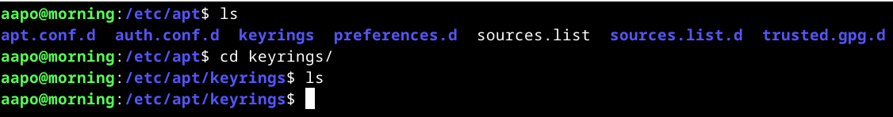

Latasin julkisen avaimen kyseiseen hakemistoon komennolla `curl -fsSL https://packages.broadcom.com/artifactory/api/security/keypair/SaltProjectKey/public | sudo tee /etc/apt/keyrings/salt-archive-keyring.pgp`, kuten alla olevasta kuvasta ilmenee.

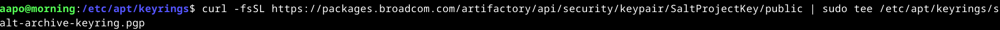

Ilman kyseistä julkista avainta en voi lisätä sallittuihin pakettilähteisiin saltin repoja, joista voin ladata tarvittavat paketit salt-työkalun käyttöön.  
(Stack Exchange Inc. URL: https://stackoverflow.com/questions/26020917/what-is-the-function-of-etc-apt-sources-list-d)

Komennossa:
|Syntaksi|Kuvaus|
|--------|------|
|**curl**|curl-komennolla voidaan siirtää dataa palvelimelta tai palvelimelle|
|**-fsSL**|curl-komennon valinnat, joista:<ul><li>**f**: Yrittää parantaa epäonnistuneen siirtoyrityksen tulosta estämällä virheilmoitusta sisältävän HTML-dokumentin siirtoa palvelimelta. Dokumentin sijasta palauttaa suoraan ”error 22”.</li><li>**s**: Hiljainen toiminto, joka estää ilmoitukset liittyen komennon edistymisen seurannan mittareihin sekä komennon edistymisen virheisiin.</li><li>**S**: Valinta ilmoittaa, että halutaan ilmoitukset edistymisen seurannan virheistä, mutta ei kumoa edistymisen seurannan estoa koskien mittaria.</li><li>**L**: Palvelimen vastatessa pyydetyn sivun vaihtuneen toiseen sijaintiin, valinnalla voidaan hakea sivua automaattisesti uudestaan sivun uudesta sijainnista.</li></ul>|
|**https://packages.broadcom.com/artifactory/api/security/keypair/SaltProjectKey/public**|URL, josta tietoja haetaan|
|**sudo tee /etc/apt/keyrings/salt-archive-keyring.pgp**|Hakemistopolku johon pgp-avain tallennetaan. tee-komennolla luetaan syöte ja tulostetaan se sekä näkyviin näytölle, että tiedostoon|

(Debianin curl-manuaali komennolla: ”man curl”)  
(Debianin tee-manuaali komennolla: ”man tee”)

Lopputuloksena avain löytyi hakemistosta, kuten alla olevasta kuvasta ilmenee.

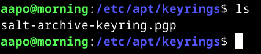

**31.3.2025 Klo 9.57**  
Oli vuorossa salt-repon lataaminen ja lisääminen polkuun */etc/apt/sources.list.d* komennolla `curl -fsSL https://github.com/saltstack/salt-install-guide/releases/latest/download/salt.sources | sudo tee /etc/apt/sources.list.d/salt.sources`.

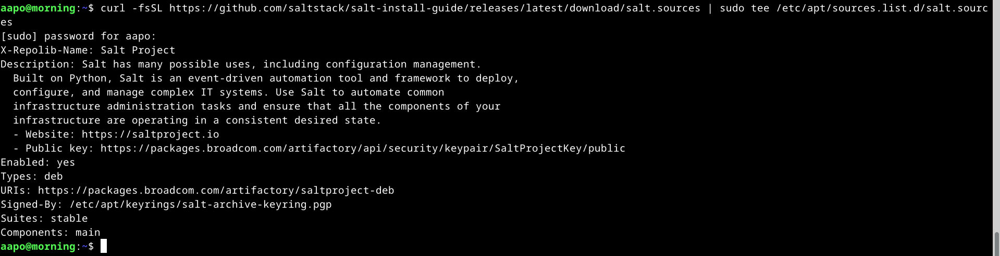

### Salt-minion daemonin asentaminen
**31.3.2025 Klo 10.35**

Salt-minionin asensin ajamalla komennon `sudo apt-get update`, jonka jälkeen komento `sudo apt-get -y install salt-minion`.

Tarkastin vielä salt-minionin asentamisen onnistumisen katsomalla sen version komennolla `sudo salt-call --version`.

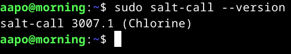

Vastauksena sain version, joten asentaminen on onnistunut.

## c) Viisi tärkeintä. Näytä Linuxissa esimerkit viidestä tärkeimmästä Saltin tilafunktiosta: pkg, file, service, user, cmd. Analysoi ja selitä tulokset.  
**31.3.2025 Klo 10.45**

### pkg-tilafunktio

Pkg-tilafunktiossa asennetaan paketteja käyttöjärjestelmän omista paketinhallintajärjestelmistä (VMware, Inc. URL: https://docs.saltproject.io/en/master/ref/states/all/salt.states.pkg.html).

Aloitin pkg-tilafunktion testaamisen komennolla `sudo salt-call --local -l info state.single pkg.installed tree`. Vastauksena sain alla olevan kuvan mukaisen tulosteen.

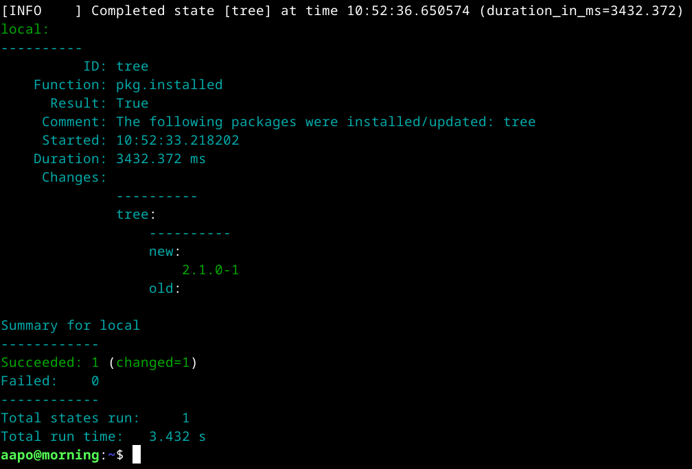

Vastauksessa:
|Elementti|Kuvaus|
|---------|------|
|**ID: tree**|ohjelma, joka haluttiin asentaa|
|**Function: pkg.installed**|tilafunktio, jota sovellettiin|
|**Result: True**|Kaikki paketit ovat asennettu, koska ”Succeeded” kohta ilmaisee, onko juuri kyseisellä komennon ajamisella muuttunut jokin?|
|**Comment**|Kommentit liittyen suoritukseen. Tässä tapauksessa ilmoittaa, että tree-ohjelma on asennettu tai päivitetty, riippuen idempotentista. Tässä kohdassa ei oteta siis kantaa onko haluttu asia idempotentti|
|**Started**|Aika, jolloin prosessin suorittaminen aloitettiin|
|**Duration**|Koko prosessiin kulunut aika millisekunteina|
|**Changes**|Ilmoittaa muutokset, jotka tehtiin suorituksessa. Tässä tapauksessa tree-ohjelma asennettiin, koska ”old” kohdassa ei ole mitään ja ”new” kohdassa on ”2.1.0-1”. ”2.1.0-1” tarkoittaa tree-ohjelman versiota, kuten allaolevasta kuvasta näkyy|
|**Succeeded**|Onnistuneet tilantarkastukset. Tässä tapauksessa yksi onnistunut tilantarkastus ja ”(changed=1)” ilmoittaa yhden tilan muuttuneen. Jos tila on idempotentti, muutoksiin liittyvää tietoa ei tule ollenkaan|
|**Failed**|Epäonnistuneet tilantarkastukset, joita tässä tapauksessa ei ole|
|**Total states run**|Kokonaisuudessaan suoritetut tilantarkastukset|
|**Total run time**|Koko prosessiin kulunut aika sekunteina|

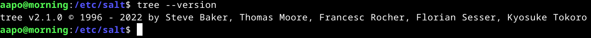  
Versio ohjelmasta tree.

Oletan Result-kohdan tarkoittavan kyseistä asiaa, koska löysin Stack Overflowsta keskustelun, jossa oli saatu Result-kohtaan arvo ”False”, sekä ”True” arvon palauttaminen, vaikka muutoksia ei ole tapahtunut ”Succeeded” kohdassa.  
(Stack Exchange Inc. URL: https://stackoverflow.com/questions/44130003/salt-stack-function-pkg-installed-yum-does-not-update-installed-package)

### file-tilafunktio
**31.3.2025 Klo 14.52**

Toisena tilafunktiona oli file-tilafunktio. Kyseisellä tilafunktiolla voidaan hallita tiedostoja ja hakemistoja (VMware, Inc. URL: https://docs.saltproject.io/en/3006/ref/states/all/salt.states.file.html).

Päätin toteuttaa testauksen tarkastamalla tilan komennolla `sudo salt-call --local -l info state.single file.managed /home/aapo/Desktop/testi -contents="Tämä on testi, jolla testaan file-tilafunktiota"`.

Komennossa `file.managed` on tilafunktio, jolla voidaan esimerkiksi tarkastaa tiedoston tila. Polku *home/aapo/Desktop/testi* viittaa tiedostoon nimeltä ”testi”, joka tuli olla työpöydälläni. Lisäksi lisäsin valinnan `-contents`, jolla sain varmistettua, että tiedostossa on haluamani teksti.

Vastaus kuvana alla

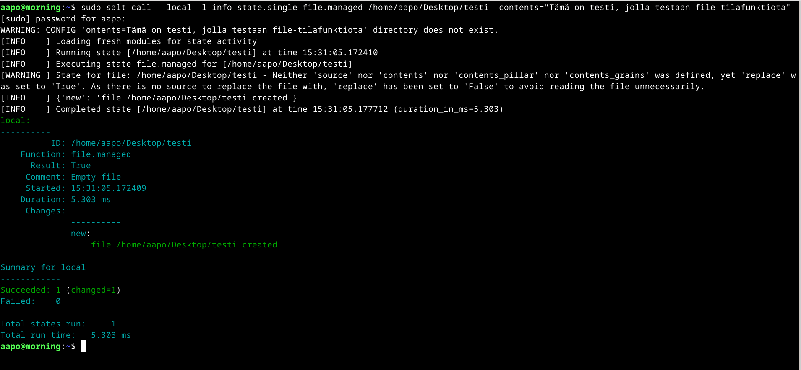

Vastauksessa:
|Elementti|Kuvaus|
|---------|------|
|**ID**|tiedosto, jota tarkastellaan|
|**Function**|Käytetty funktio|
|**Result**|Onko tarkastelu onnistunut|
|**Changes**|Luotu tiedosto tarkastelussa|
|**Succeeded**|Onnistuneet tilantarkastukset|
|**Failed**|Epäonnistuneet tilantarkastukset|

Huomasin tosin tämän jälkeen, että testi-tiedostossa ei ollut tekstiäni, joka näkyy alla olevasta kuvasta.

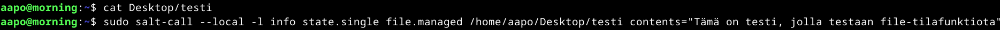

Tajusin, että `-contents` valinnasta tulee ottaa ”-” edestä pois, kuten Teron materiaaleista näkyykin (Karvinen. URL: https://terokarvinen.com/2021/salt-run-command-locally/).

Ajoin komennon uudestaan ilman viivaa valinnan edessä, jolloin vastaus oli kuten alla olevasta kuvasta näkyy.

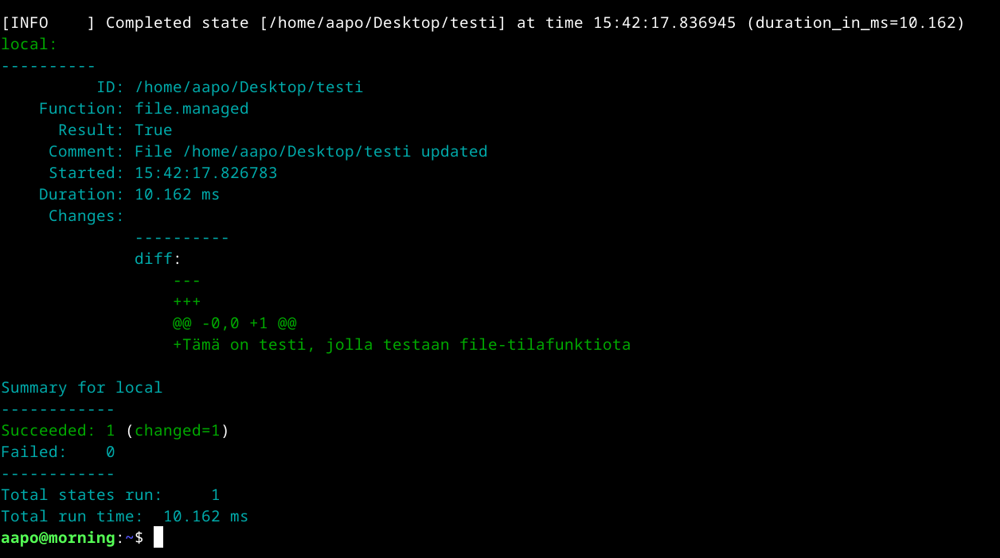

Kuvassa:
|**Comment**|Tiedosto päivitettiin, koska tiedosto oli jo valmiina olemassa, tästä ilmaisu ”updated”|
|**Changes**|<ul><li>diff = Vertailee tilaa vanhan ja uuden tiedoston välillä</li><li>--- = Tiedostosta poistettu tietoa riveiltä, jotka ilmoitetaan @@... kohdassa</li><li>+++ = Tiedostoon lisätty tietoa riveille, jotka ilmoitetaan @@... kohdassa</li><li>@@ -0,0 +1 @@ = ”-0” ilmoittaa, että tiedostossa ei ollut ennen tilafunktion suorittamista tietoa. ”,” erottaa tiedostojen rivit. ”0 +1” kertoo tiedostoon lisätyn tiedon sijainnin riveillä 0-1</li><li>+Tämä on testi, jolla testataan file-tilafunktiota = Teksti, joka on lisätty tiedostoon aiemmin ilmoitetuille riveille</li></ul>|

(Suoranaista lähdettä en ”Changes” alikohdille löytänyt, mutta päättelin ne näistä lähteistä: GeeksforGeeks. URL: https://www.geeksforgeeks.org/diff-command-linux-examples/ & Stack Exchange Inc. URL: https://stackoverflow.com/questions/4061302/what-is-the-diff-file-syntax)

Tarkastin, että olihan teksti tullut kyseiseen tiedostoon, joten katsoin komennolla `cat Desktop/testi` tiedoston sisällön polussa */home/aapo*.

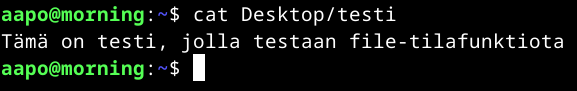

Siellähän se oli, kuten pitääkin.

### service-tilafunktio
**31.3.2025 Klo 17.35**

Service-tilafunktiota käytetään palveluiden ja daemonien käynnistykseen tai uudelleenkäynnistykseen (VMware, Inc. URL: https://docs.saltproject.io/en/3006/ref/states/all/salt.states.service.html).

Päätin kokeilla palomuuria, jonka halusin olevan päällä. Tämän johdosta komento `sudo salt-call --local -l info state.single service.running ufw enable=True`.

Vastauksesta kuvakaappaus alla.

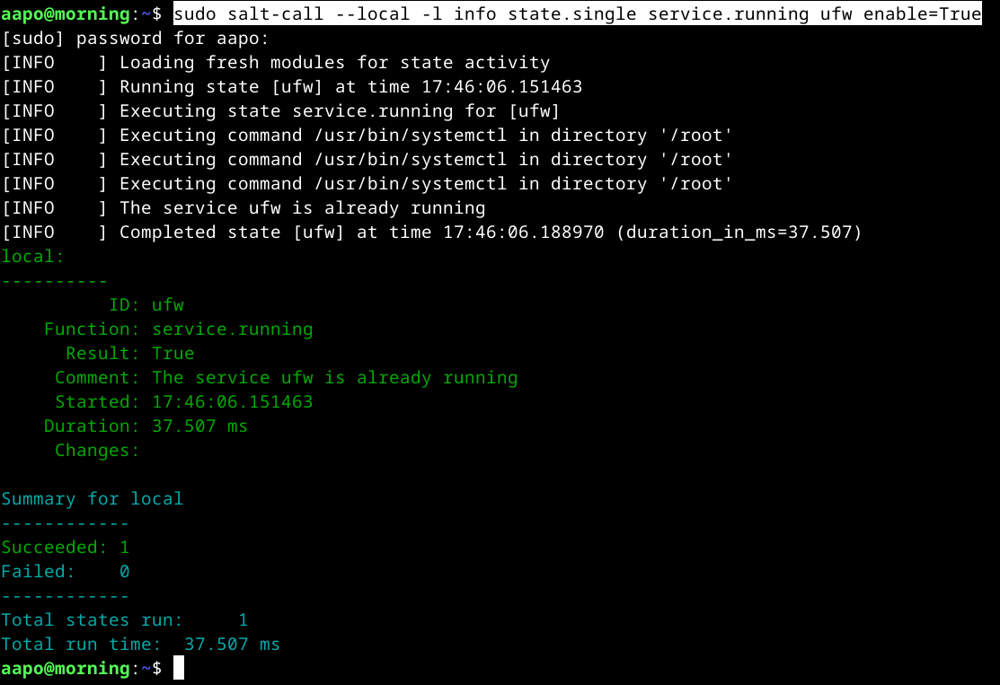

Kuvassa:
|Elementti|Kuvaus|
|---------|------|
|**ID**|Kertoo kohteena olevan palvelun eli ufw|
|**Comment**|Ilmoittaa ufw:n olevan jo valmiina päällä|

Kuvassa yksi onnistunut tarkastus ilman muutoksia.

### user-tilafunktio

Saltin virallisen dokumentaation mukaan user-tilafunktion tarkoituksena on hallinnoida käyttäjätilejä (VMware, Inc. URL: https://docs.saltproject.io/en/3006/ref/states/all/salt.states.user.html).

Tarkastin komennolla `sudo salt-call --local -l info state.single user.present albert-testi` tilan, jotta kyseinen käyttäjä ”albert-testi” on luotuna. Kuva vastauksesta alla.

Kuvassa:
|**ID**|Tunnisteena tässä tapauksessa haluttu käyttäjä|
|**Comment**|Käyttäjä on luotu, koska sitä ei ollut olemassa aiemmin|
|**Changes**|Muutokset, joissa <ul><li>gid (group id) = Kertoo ryhmän tunnisteen</li><li>groups = Ryhmät, joihin käyttäjä kuuluu, tässä tapauksessa vain omaan yhden käyttäjän ryhmään</li><li>home = Polku käyttäjän kotihakemistoon</li><li>name = Käyttäjän nimi (fullname on käyttäjän reaalimaailman etu- ja sukunimi)</li><li>passwd = Käyttäjän salasana, jota en antanut komennossa valinnalla, joten x-merkki kertoo käyttäjän olevan ilman salasanaa</li><li>shell = Polku käytettävään ei-interaktiiviseen oletus-shelliin  (Debian. URL: https://wiki.debian.org/Shell)</li><li>uid (user id) = Käyttäjän tunniste</li></ul>|

Koska vastauksessa tiedotettiin muutoksista, käyttäjää ei ollut aikaisemmin paikallisella koneellani, joka simuloi minionia.

Alla olevassa kuvassa näkyy käyttäjän olevan luotu, koska tiedot löytyvät tiedostopolusta */etc/passwd*.

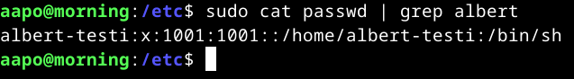

### cmd-tilafunktio  
**31.3.2025 Klo 18.29**

Jälleen kerran lähteenä saltin oma dokumentaatio, jossa kerrotaan cmd-tilafunktion suorittavan komentoja, joita voidaan myös määritellä ajettavan vain tiettyjen ehtojen täyttyessä (VMware, Inc. URL: https://docs.saltproject.io/en/3006/ref/states/all/salt.states.cmd.html).

Opettaja Tero Karvinen kertoo artikkelissaan, että cmd-tilafunktion sijasta tulee käyttää ennemmin file-, service- tai user-tilafunktioita (URL: https://terokarvinen.com/2021/salt-run-command-locally/).

Halusin koittaa cmd-tilafunktiosta unless-ehtoa, joka toteuttaa komennon, vain ehdon ollessa epätosi.

Komennolla `sudo salt-call --local -l info state.single cmd.run echo 'Tämä on puolestaan testi cmd-tilafunktiosta' unless='/home/aapo/Desktop/tiedosto_joka_ei_ole_olemassa'` tuli mielenkiintoinen vastaus, koska huomasin tiedostopolun puuttuvan, johon merkkijono olisi lisätty.

Lisäksi ehto oli epätosi, koska *'/home/aapo/Desktop/tiedosto_joka_ei_ole_olemassa'* tiedostoa ei ollut olemassa, joten komento suoritettiin. Sain siis vastaukseksi alla olevassa kuvassa ilmenevät seikat.

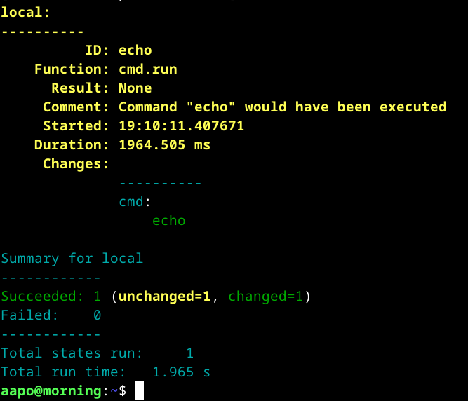

Vastauksessa:
|**Elementti**|**Kuvaus**|
|-------------|----------|
|**ID**|Komento, joka tuli suorittaa ehtojen täyttyessä|
|**Comment**|Kommentissa kerrotaan, että ”echo” komento olisi suoritettu, koska ehto oli epätosi|
|**Changes**|Komento `echo` suoritettiin, mutta oletan, että joko merkkijonoa ei olisi oikeissa minion-koneissa tulostettu näytölle tai ne olisi tulostettu näytölle, mutta kuten seuraavasta kohdasta nähdään mikään ei ole pysyvästi muuttunut. Muutos olisi ollut vain hetki, jolloin merkkijono tulostetaan.|
|**Succeeded**|Onnistuneita tarkasteluita on yksi. Ironisesti vastauksessa lukee myös, että yhtä muutosta ei ole tehty ja samalla että yksi on tehty|

Jatkoin edelleen ja kokeilin lisätä tiedostopolun ja tarvittavan ”>” merkin, jotta alkuperäinen suunnitelma onnistuisi. Sain kuitenkin virheilmoituksen, että oikeudet eivät ole kunnossa.

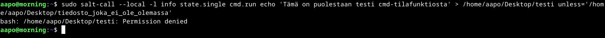

Kävin tarkistamassa oikeudet, ja muuten kaikki oli kunnossa, mutta testi-tiedoston omistaja oli root, joten muutin omistajaksi aapo komennolla `sudo chown aapo:aapo testi` polussa */home/aapo/Desktop*.

Kokeilin erilaisia syntakseja, mutta turhaan, koska aina sain samanlaisen vastauksen (kuva alla).

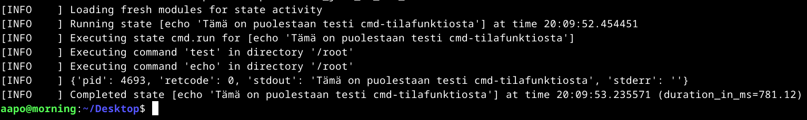

Työpöydällä sijaitseva testi-tiedosto taas näytti aina tältä (kuva alla).

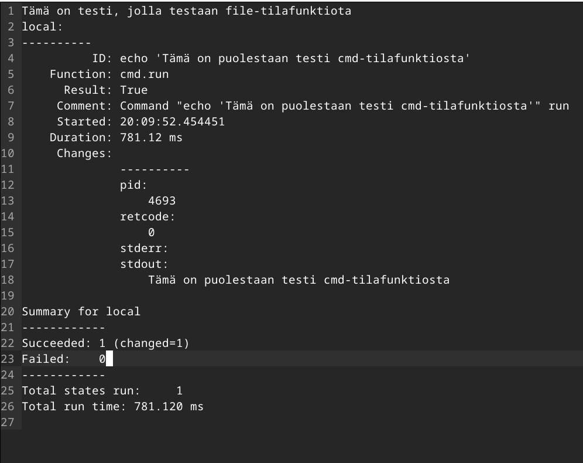

Tämä riittänee tältä erää kyseisestä tilafunktiosta, koska cmd-tilafunktiota ei tulisikaan käyttää, kuten aiemmin mainitsinkin lähteeseen vedoten.

## d) Idempotentti. Anna esimerkki idempotenssista. Aja 'salt-call --local' komentoja, analysoi tulokset, selitä miten idempotenssi ilmenee.
**31.3.2025 Klo 20.26**  

Idempotentin määritelmä on Suomisanakirjan mukaan tietojenkäsittelytieteessä tila, joka on muuttumaton saavutettuaan ensimmäisen kerran kyseisen tilan. Toistuvat kutsut eivät siis muuta kyseistä tilaa.  
(Suomisanakirja. URL: https://www.suomisanakirja.fi/idempotentti).

Olenkin aiemmin jo käsitellyt idempotenssia hieman, mutta ajoin saman komennon kuin aikaisemmin, eli `sudo salt-call --local -l info state.single pkg.installed tree`, joka haluaa tree-ohjelman olevan asennettu. Vastaus oli kuvan kaltainen.

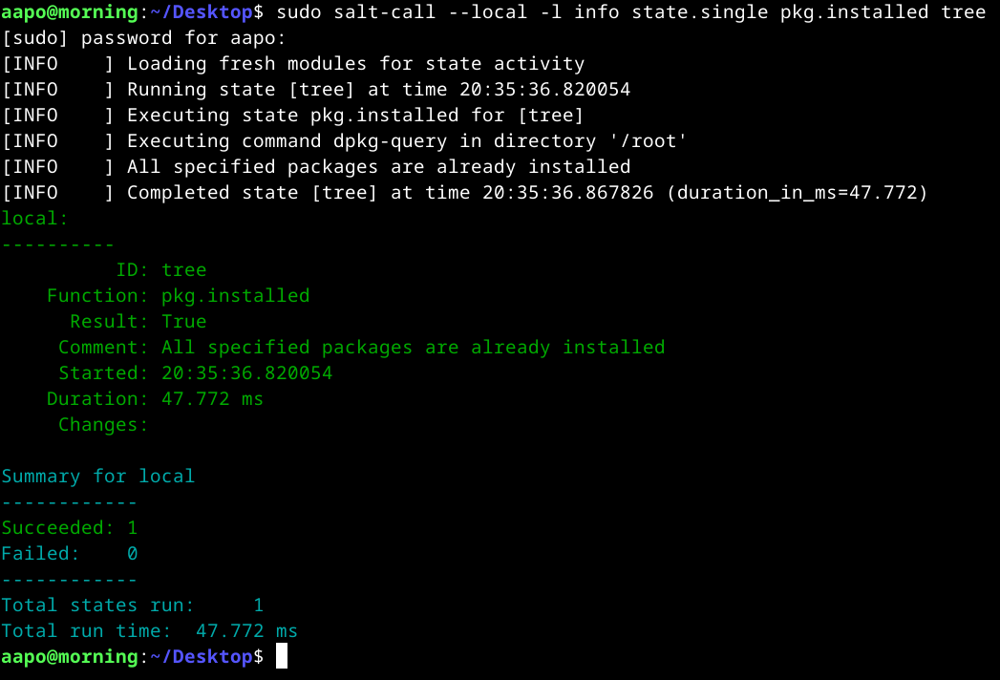

Kuvassa ilmeni idempotentti info sarakkeessa lauseesta: *”All specified packages are already installed”*. ”Comment” kohdassa, ilmoitettiin sama asia kuin infossa, eli kaikki paketit olivat jo asennettuna. Lisäksi ”Succeeded” ja ”Changes” kohdissa ei ilmoitettu mistään muutoksista, joten tila oli idempotentti. (Toki tilan tarkastelun onnistuminen vaaditaan myös osoittamaan tilan olevan idempotentti.)

Otan toisen esimerkin. Ajoin komennon `sudo salt-call --local -l info state.single file.managed /home/aapo/Desktop/testi contents="Tämä on testi, jolla testaan file-tilafunktiota"` kaksi kertaa, koska ensimmäisen kerran muutoksia toteutettiin aiemman cmd-tilafunktion johdosta. Toisen komennon ajamisen tulos oli alla olevan kuvan kaltainen.

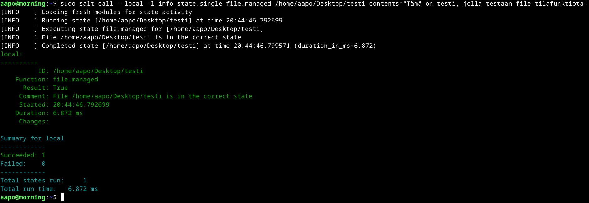

Ensinnäkin info sarakkeesta huomasi tilan olevan idempotentti lauseesta: *”File /home/aapo/Desktop/testi is in the correct state”*.

Toisekseen, ”Comment”, ”Succeeded” ja ”Changes” kohdissa ei ollut mitään tietoa saatavilla muutoksista.

## Lähteet

Debian. 26.2.2025. Shell. Luettavissa: https://wiki.debian.org/Shell. Luettu: 31.3.2025.

Debianin curl-manuaali komennolla: ”man curl”. Luettu: 31.3.2025.

Debianin tee-manuaali komennolla: ”man tee”. Luettu: 31.3.2025.

GeeksforGeeks. 12.7.2024. How to Compare Files Line by Line in Linux | diff Command. Luettavissa: https://www.geeksforgeeks.org/diff-command-linux-examples/. Luettu: 31.3.2025.

Karvinen, T. 4.6.2006. Raportin kirjoittaminen. Luettavissa: https://terokarvinen.com/2006/06/04/raportin-kirjoittaminen-4/. Luettu: 27.3.2025.

Karvinen, T. 28.3.2018. Salt Quickstart – Salt Stack Master and Slave on Ubuntu Linux. Luettavissa: https://terokarvinen.com/2018/03/28/salt-quickstart-salt-stack-master-and-slave-on-ubuntu-linux/. Luettu: 27.3.2025.

Karvinen, T. 28.10.2021. Run Salt Command Locally. Luettavissa: https://terokarvinen.com/2021/salt-run-command-locally/. Luettu: 27.3.2025.

Suomisanakirja. idempotentti. Luettavissa: https://www.suomisanakirja.fi/idempotentti. Luettu: 31.3.2025.

Stack Exchange Inc. 2017. Salt Stack: Function: pkg.installed. Yum does not update installed package. Luettavissa: https://stackoverflow.com/questions/44130003/salt-stack-function-pkg-installed-yum-does-not-update-installed-package. Luettu: 31.3.2025.

Stack Exchange Inc. 2018. What is the Diff file syntax. Luettavissa: https://stackoverflow.com/questions/4061302/what-is-the-diff-file-syntax. Luettu: 31.3.2025.

Stack Exchange Inc. 30.3.2025. what is the function of /etc/apt/sources.list.d? [closed]. Luettavissa: https://stackoverflow.com/questions/26020917/what-is-the-function-of-etc-apt-sources-list-d. Luettu: 31.3.2025.

Suomisanakirja. idempotentti. Luettavissa: https://www.suomisanakirja.fi/idempotentti. Luettu: 31.3.2025.

VMware, Inc. Linux (DEB). Luettavissa: https://docs.saltproject.io/salt/install-guide/en/latest/topics/install-by-operating-system/linux-deb.html. Luettu: 27.3.2025.

VMware, Inc. salt.states.cmd. Luettavissa: https://docs.saltproject.io/en/3006/ref/states/all/salt.states.cmd.html. Luettu: 31.3.2025.

VMware, Inc. salt.states.file. Luettavissa: https://docs.saltproject.io/en/3006/ref/states/all/salt.states.file.html. Luettu: 31.3.2025.

VMware, Inc. salt.states.pkg. Luettavissa: https://docs.saltproject.io/en/master/ref/states/all/salt.states.pkg.html. Luettu: 31.3.2025.

VMware, Inc. salt.states.service. Luettavissa: https://docs.saltproject.io/en/3006/ref/states/all/salt.states.service.html. Luettu: 31.3.2025.

VMware, Inc. salt.states.user. Luettavissa: https://docs.saltproject.io/en/3006/ref/states/all/salt.states.user.html. Luettu: 31.3.2025.
 
 
 
 
 
 
*Tätä dokumenttia saa kopioida ja muokata GNU General Public License (versio 3 tai uudempi) mukaisesti. http://www.gnu.org/licenses/gpl.html*
