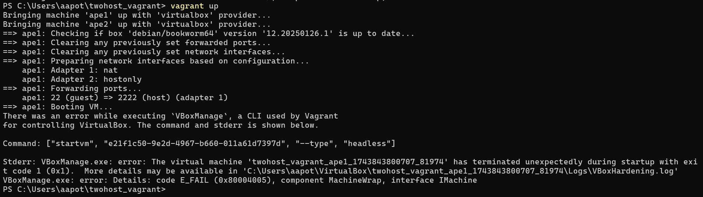
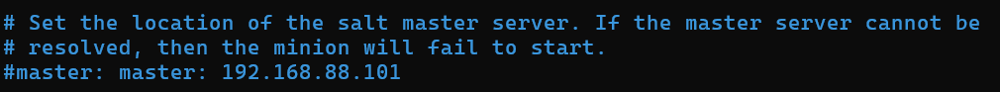
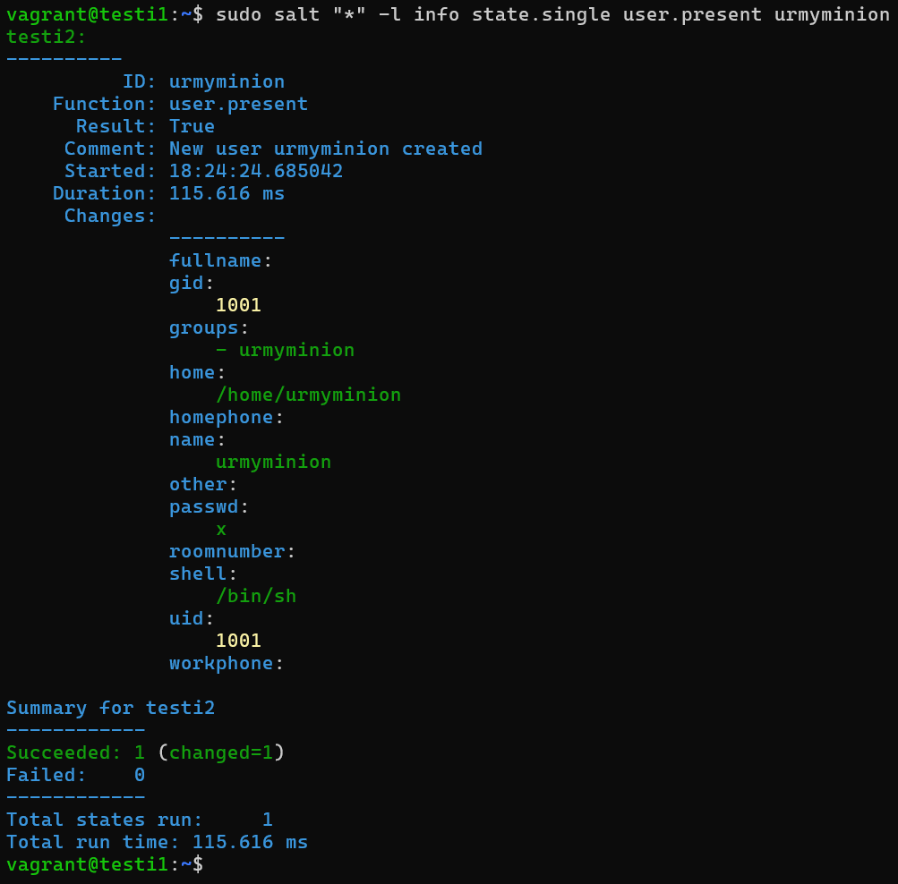

*Tekijä: Aapo Tavio*

*Pohjana Tero Karvinen 2025: Palvelinten Hallinta 2025 kevät, https://terokarvinen.com/palvelinten-hallinta/*

# h2 Soitto Kotiin

## Käytettävän ympäristön ominaisuudet

- Isäntä
  >- HP Laptop 15s-eq3xxx  
  >- Microsoft Windows 11 Home (versio 24H2)  
  >- AMD Ryzen 7 5825U, Radeon Graphics  
  >- 16 GB RAM (15,3 GB käytettävissä)
  >- x64-pohjainen
  >- Verkkokorttina Realtek WiFi 6

- Paikallinen virtuaalikone
 	 >- Debian GNU/Linux 12 (bookworm) xfce
 	 >- Virtualbox

## x) Lue ja tiivistä. (Tässä x-alakohdassa ei tarvitse tehdä testejä tietokoneella, vain lukeminen tai kuunteleminen ja tiivistelmä riittää. Tiivistämiseen riittää muutama ranskalainen viiva. Ei siis vaadita pitkää eikä essee-muotoista tiivistelmää.)

### (Karvinen 2021. URL: https://terokarvinen.com/2021/two-machine-virtual-network-with-debian-11-bullseye-and-vagrant/)

-	Vagrantilla voi:
  >- Automaattisesti luoda virtuaalikoneita  
  >- SSH-kirjautumista automatisoida virtuaalikoneisiin
-	Lisäksi graafista käyttöliittymää ei vaadita vagrantin käyttämiseen
-	Vagrant-tiedostoon tehdään tarvittavat asetukset, jotka halutaan luotaville virtuaalikoneille  
```
vagrant destroy #Kaikki vagrantilla luodut virtuaalikoneet tuhotaan kaikkine tiedostoineen

vagrant up #Luodaan uudet tyhjät koneet konfigurointitiedoston perusteella
```

### (Karvinen 2018. URL: https://terokarvinen.com/2018/salt-quickstart-salt-stack-master-and-slave-on-ubuntu-linux/?fromSearch=salt%20quickstart%20salt%20stack%20master%20and%20slave%20on%20ubuntu%20linux)

-	Slave-koneita voidaan hallita master-koneelta, vaikka slavet olisivat NAT:in tai palomuurin takana taikka jopa niiden osoitteita ei tietäisi
-	Master-koneella on oltava julkinen palvelin ja julkinen osoite
-	Master-koneelle on asennettava oma ohjelma ja slave-koneelle oma ohjelmansa
-	Slave-koneelle on lisättävä master-koneen IP-osoite
-	Master-koneella on hyväksyttävä slave-avain vielä lopuksi

### (Karvinen 2023. URL: https://terokarvinen.com/2023/salt-vagrant/#infra-as-code---your-wishes-as-a-text-file)

-	Infra as Code-menetelmällä voidaan kätevästi määritellä ajettavat tilafunktiot
-	"Top-hakemisto" helpottaa edelleen infraa koodina menetelmää, koska siinä voidaan konfiguroida mitkä moduulit ajetaan milläkin slave/minion-koneilla
  >- Ei tarvitse toisin sanoen määritellä `state.apply` komennossa enää tiettyä moduulia

## a) Hello Vagrant! Osoita jollain komennolla, että Vagrant on asennettu (esim tulostaa vagrantin versionumeron). Jos et ole vielä asentanut niitä, raportoi myös Vagrant ja VirtualBox asennukset. (Jos Vagrant ja VirtualBox on jo asennettu, niiden asennusta ei tarvitse tehdä eikä raportoida uudelleen.)

### Vagrantin asennus
**3.4.2025 Klo 15.01**

Aloitin vagrantin asentamisen windows host-koneelleni lataamalla asennustiedoston osoitteesta: https://developer.hashicorp.com/vagrant/install. Versio oli *AMD64, 2.4.3*.

Asennustiedoston käynnistämisen jälkeen hyväksyin ehdot ja syötin pääkäyttäjän salasanan aloittaakseni asennuksen. Asennusprosessin päätteeksi käynnistin uudelleen tietokoneeni, kuten asennusohjelma kehotti. Tämän jälkeen tulostin komentokehotteella vagrantin version windows host koneellani komennolla `C:\Users\aapot>vagrant version`.


Kaikki oli kuten pitääkin, eli vagrant oli asennettu koneelleni.

## b) Linux Vagrant. Tee Vagrantilla uusi Linux-virtuaalikone.

### Hakemistojen luominen ja vagrant-tiedoston alustus

**4.4.2025 Klo 13.42**

Minun piti ensimmäiseksi tehdä uusi hakemisto uudelle *vagrant*-tiedostolle, joten powershellissä komento `PS C:\Users\aapot> mkdir twohost_vagrant`.


Tarkistin vielä, että hakemisto oli luotu komennolla `PS C:\Users\aapot> Get-Item "twohost_vagrant"`.


Sitten oli vuorossa vagrant-tiedosto. Komennolla `PS C:\Users\aapot\twohost_vagrant> vagrant init`, loin oletustiedoston vagrantille, kuten virallisissa ohjeissa ohjeistetaan.  
(HashiCorp. URL: https://developer.hashicorp.com/vagrant/tutorials/get-started/setup-project).


Katsoin vielä hakemiston sisällön komennolla `dir`.


Powershellissä ei ilmeisesti ole tekstieditoria itsessään, joten komentona
```
PS C:\Users\aapot\twohost_vagrant> notepad.exe .\Vagrantfile. #Avaa Vagrantfile-tiedoston notepad-tekstieditorissa
```

Poistin kaikki kommenttirivit tiedostosta, jolloin lopputulos oli alla olevan kuvan kaltainen.


Tiedostoon jäi siis kaksi riviä tekstiä ainoastaan.

### Debian-käyttöjärjestelmän määrittäminen virtuaalikoneelleni

**4.4.2025 Klo 14.50**

Etsittyäni tietoa netistä, mitä tietoja minun pitäisi laittaa *Vagrantfile*-tiedostoon, löysin debianin virallisten sivujen kautta HashiCorpin sivun, jossa oli tiedot debian/bookworm:n tarvittavista tiedoista konfigurointitiedostoon.  
(HashiCorp. URL: https://portal.cloud.hashicorp.com/vagrant/discover/debian/bookworm64)

Alla olevassa kuvassa näkyy lopputulos *Vagrantfile*-tiedostosta.


Kuvassa:
```
config.vm.box = "debian/bookworm64" #64 bittinen debian 12 bookworm käyttöjärjestelmä

config.vm.box = "12.20250126.1" #Versio yllä olevasta käyttöjärjestelmästä
```

Laitoin virtuaalikoneen ylös komennolla `vagrant up`.

Tajusin, että en ollut määritellyt host-nimeä vagrant-debian koneelleni, joten tarkistin koneen hostnamen komennolla `PS C:\Users\aapot\twohost_vagrant> vagrant status`.


Kuvassa *default* oli hostname, jota voin käyttää ssh-yhteyden luomiseen vagrant-koneeseeni windows-host koneelta. *Running* puolestaan kertoo, että virtuaalikone on käynnissä ja *(virtualbox)* kertoo virtualisointialustan.


### SSH-yhteyden muodostaminen *default*-virtuaalikoneeseeni

Luonnollisesti seuraava vaihe oli ssh-yhteyden muodostaminen vagrant-virtuaalikoneeseeni, joten komento
```
PS C:\Users\aapot\twohost_vagrant> vagrant ssh default #Muodostaa yhteyden default-virtuaalikoneeseeni
```


Sain yhteyden vagrant-virtuaalikoneeseeni. Alla olevassa kuvassa näkyy virtuaalikoneen hostname, kun ajoin virtuaalikoneen sisällä komennon `vagrant@bookworm:~$ hostname`.


Oletan *bookworm* hostnamen olevan virtuaalikoneen "todellinen" hostname. *Default* hostname on olettaakseni vain vagrantiin liitetty hostname.

Ajoinkin vielä komennon `PS C:\Users\aapot\twohost_vagrant> vagrant ssh bookworm` windows-isäntäkoneellani, jolla yritin ottaa yhteyttä virtuaalikoneeseen *bookworm* hostnamella. Tämä ei onnistunut, kuten alla olevasta kuvasta näkyy.


Lopuksi vielä tuhosin virtuaalikoneeni komennolla `PS C:\Users\aapot\twohost_vagrant> vagrant destroy`.


Komennon jälkeen vastasin vain "y"(yes) kysymykseen olenko varma, että haluan tuhota *default* nimisen virtuaalikoneen?

Kone oli tuhottu, kuten alla olevasta kuvasta ilmenee kohdasta "not created".


## c) Kaksin kaunihimpi. Tee kahden Linux-tietokoneen verkko Vagrantilla. Osoita, että koneet voivat pingata toisiaan.

### *Vagrantfile* tiedoston muokkaaminen

**5.4.2025 Klo 10.46**

Tutkittuani asioita, joita minun pitäisi lisätä *Vagrantfile* tiedostoon luodakseni kaksi virtuaalikonetta yhden sijasta, löysin HashiCorpin sivuilta tietoa. *Provisioners* auttaa tekemään automaattisesti konfiguraatioita koneisiin, kuten sovellusten asentamista  
(URL: https://developer.hashicorp.com/vagrant/docs/provisioning).

Olettaisin, että minun ei tarvitse kyseistä menetelmää käyttää, koska minun ei tehtävässä tarvitse asentaa valmiiksi muita ohjelmia, kuin mitä oletuksena koneisiin tulee.

Koneitten määrittäminen tapahtuu taas `config.vm.define` metodilla  
(HashiCorp. URL: https://developer.hashicorp.com/vagrant/docs/multi-machine).

Edelleen opettajan Tero Karvisen sivua ja HashiCorpin sivua `config.vm.define` metodin käytöstä mukaillen alan saamaan hahmotuksen, mitä voisin laittaa tiedostoon?  
(Karvinen. URL: https://terokarvinen.com/2021/two-machine-virtual-network-with-debian-11-bullseye-and-vagrant/)  
(HashiCorp. URL: https://developer.hashicorp.com/vagrant/docs/vagrantfile/machine_settings)

**5.4.2025 Klo 11.20**

Vagrantin `primary: true do` valinta ilmeisesti asettaa kyseisen koneen oletukseksi komennoille, joten en tarvitse kyseistä valintaa  
(Stack Exchange Inc. URL: https://stackoverflow.com/questions/20863679/vagrant-primary-box-defined-but-commands-still-run-against-all-boxes).

Komennolla `PS C:\Users\aapot\twohost_vagrant> notepad.exe .\Vagrantfile` avasin *Vagrantfile* tiedoston, johon lisäsin tarvittavat muutokset. Lopputulos näkyy alla olevassa kuvassa.


Kuvassa:
```
config.vm.define "ape1" do |ape1| #ape1 on muuttuja, joka halutaan luoda, tässä tapauksessa "ape1"

ape1.vm.hostname = "ape1" #Hostname, joka halutaan antaa koneelle, tässä tapauksessa "ape1"

ape1.vm.network "private_network", ip: "192.168.88.101" #Verkon määritykset, jotka halutaan antaa koneelle, tässä tapauksessa yksityinen verkko-osoite
```

Ja samat määritykset toiselle koneelle alla, mutta muuttuja ja hostname on *ape2* sekä tietenkin yksityinen verkko-osoite on eri kuin *ape1*. Molemmat kuitenkin samassa verkkoavaruudessa.

Oletan, että ainakin ilman verkkoasetuksiakin koneet olisivat toimineet, jolloin osoitteet olisivat tulleet automaattisesti, mutta laitoin ne varmuuden vuoksi.

Komennolla `PS C:\Users\aapot\twohost_vagrant> vagrant up` tuli virheilmoitus syntaksivirheestä, joka näkyy alla olevasta kuvasta.


### Ongelman ratkaiseminen

Oletan virheen olevan rivillä 15 virheilmoituksesta päätellen. En ymmärtänyt tarkalleen ottaen, mikä end-sanassa on pielessä, mutta katsottuani uudestaan syntaksia ja verratessani sitä opettajan vastaavaan, huomasin virheen. Minulta puuttui vielä yksi end-sana tiedoston lopusta, joten lisäsin sen.


**5.4.2025 Klo 12.02**

Yritin uudestaan komentoa `PS C:\Users\aapot\twohost_vagrant> vagrant up`, mutta seurauksena minun olisi pitänyt antaa pääkäyttäjätunnukseni salasana, joten en suostunut ja virheilmoitus oli alla olevan kuvan mukainen.


Etsin netistä tietoa, onko pakko antaa pääkäyttäjän salasana, mutta en löytänyt juuri mitään. Ehkä osittain siksi että käytän windowsia.

Päätin siis antaa pääkäyttäjän salasanan, ja jouduinkin sen tekemään kaksi kertaa peräkkäin, mutta sen jälkeen tuli alla olevan mukainen virheilmoitus.


**5.4.2025 Klo 12.50**

Ilmeisesti verkkoadapterissa on jotain häikkää virheilmoituksen perusteella. Aloitin päivittämällä virtualbox-ohjelmani, sillä siihen oli saatavilla uusi versio. Tämän jälkeen uudestaan komento `PS C:\Users\aapot\twohost_vagrant> vagrant up`. Tuloksena oli taas virheilmoitus, mutta hieman erilainen sellainen.



Katsoin hieman virheilmoituksessa olevaa tiedostoa *VboxHardening.log*, jossa voisi olla lisätitetoa. Löysin tiedostosta alla olevan mukaisen tekstin.


Lokitiedoston virheilmoitus ei sano itselleni yhtään mitään.

Etsittyäni tietoa netistä virheilmoituksista, löysin keskustelun, jossa kehotettiin koittamaan virtualboxin GUI:n kautta löydettävää virheilmoitusta käynnistettäessä virtuaalikonetta  
(Github, Inc. URL: https://github.com/hashicorp/vagrant/issues/10314).

Sain kyseisenlaisen virheilmoituksen:


Käynnistin uudelleen tietokoneeni, mutta turhaan, sillä sama virheilmoitus tuli kuin aikaisemmin.


**5.4.2025 Klo 15.34**

Ajattelin ensiksi poistaa Virtualboxin asennuksen ja asentaa sen uudelleen. Silti minulle tuli sama virheilmoitus, joten poistin vagrantin asennuksen ja asensin sen uudelleen.

Tämän jälkeen sain luotua haluamani kaksi virtuaalikonetta. Arvelen, että olisin voinut välttää virheen tekemällä uuden hakemiston uusille vagrant-tiedostoille ja koneille. Opettajan ohjeet alkavat aina uuden hakemiston tekemisestä ja muistelen lukeneeni jostain, että pitäisi luoda aina uusi hakemisto uudelle vagrant-projektille.

### *Vagrantfile* tiedoston alustus ja muokkaaminen uudelleen

Joka tapauksessa komennolla `PS C:\Users\aapot\Vagrant_confs\h2_c> vagrant init` aloitin alustamaan hakemiston *h2_c* vagrant-koneille. Tämän jälkeen komennolla `PS C:\Users\aapot\Vagrant_confs\h2_c> notepad.exe .\Vagrantfile` avasin *Vagrantfile* tiedoston, johon lisäsin alla olevan kuvan mukaiset tiedot. Tiedot ovat samat kuin aiemmin, mutta olen  muuttanut koneet *ape1 ➡️ testi1* ja *ape2 ➡️ testi2*.


Tämän jälkeen virtuaalikoneet pitäisi olla luotuna, koska ei tullut virheilmoitusta, vaan samankaltaiset pitkät vastaukset kuin b-kohdan konetta luodessa.

Edelleen tarkastin komennolla `PS C:\Users\aapot\Vagrant_confs\h2_c> vagrant status`, että koneet pyörivät ja näin myös olikin!


### SSH-yhteyksien luominen ja ping-testit

Komennolla `PS C:\Users\aapot\Vagrant_confs\h2_c> vagrant ssh testi1` lähti homma käyntiin ja sain yhteyden testi1-virtuaalikoneeseeni.


Komennolla `vagrant@testi1:~$ exit` lähdin pois koneelta ja tämän jälkeen kirjauduin testi2-koneelle komennolla `PS C:\Users\aapot\Vagrant_confs\h2_c> vagrant ssh testi2`.


Ja sehän toimi myös.

Seuraavaksi koitin pingata koneita, joten testi2-koneella komento oli `vagrant@testi2:~$ ping -c 1 192.168.88.101`. Sekin onnistui.


Komennossa:
```
-c 1 #Lähettää vain yhden ICMP ECHO_REQUEST paketin vastaanottajalle (Debianin man-sivu komennolla man ping)

192.168.88.101 #testi1-koneen yksityinen IP-osoite
```

Testistä näkee, että se oli onnistunut, koska siinä lukee *"1 packets transmitted, 1 received, 0% packet loss"*.

Pingasin vielä lisäksi testi1-koneelta komennolla `vagrant@testi1:~$ ping -c 1 192.168.88.102`. Tämäkin onnistui ja sain samanlaisen ilmoituksen kuin aiemmin, mutta IP-osoitteiden paikat ovat luonnollisesti vaihtuneet.


## d) Herra-orja verkossa. Demonstroi Salt herra-orja arkkitehtuurin toimintaa kahden Linux-koneen verkossa, jonka teit Vagrantilla. Asenna toiselle koneelle salt-master, toiselle salt-minion. Laita orjan /etc/salt/minion -tiedostoon masterin osoite. Hyväksy avain ja osoita, että herra voi komentaa orjakonetta.

### *Vagrantfile* tiedostoon skriptien lisääminen

**5.4.2025 Klo 19.18**

Löysin netistä virallisen HashiCorpin sivun, jossa kerrottiin, että pitäisi ajaa `vagrant reload` komento *Vagrantfile* tiedoston muuttamisen jälkeen. Joten oletan, että tiedostoa saakin (ja jossain määrin tarkoituskin) muokata.  
(HashiCorp. URL: https://developer.hashicorp.com/vagrant/docs/cli/reload)

Lisäsin opettaja Tero Karvisen materiaaleista scriptin, jolla sain suoraan asennettua *testi1* koneelle salt-master ohjelman ja *testi2* koneelle salt-minion ohjelman.  
(URL: https://terokarvinen.com/2023/salt-vagrant/#infra-as-code---your-wishes-as-a-text-file)

Alla kuva *Vagrantfilestä*.


Kuvassa:

Tiedoston alussa on skriptit, jotka lataavat master tai minion-ohjelman.
```
testi1.vm.provision :shell, inline: $master #Kertoo, että käynnistyksessä luetaan master-script

testi2.vm.provision :shell, inline: $minion #Kertoo, että käynnistyksessä luetaan minion-script
```

Toki nämä ohjelmat saisi asennettua käsinkin, mutta hyvä opetella tulevaisuutta varten hyödyntämään tätä tapaa.

Laitoin ensimmäiseksi komennon `PS C:\Users\aapot\Vagrant_confs\h2_c> vagrant reload --provision`, jolla sain uudet asetukseni käyttöön *Vagrantfile* tiedostosta. `--provision` valinta pakottaa lataamaan provisionerit uudestaan, joka sisälsi minulla nyt viittauksen skriptiini.

### Koneiden käynnistäminen ja Saltin asennus

Tämän jälkeen komento `PS C:\Users\aapot\Vagrant_confs\h2_c> vagrant up`, jolla sain koneet ylös.

Jostain syystä salt ei ollut asentunut testi2-koneeseen


joten lisäsin sen sitten manuaalisesti.

Annoin komennon `vagrant@testi2:/etc$ sudo apt-get update`. Tajusin tässä vaiheessa, että minullahan ei ollut lisättynä julkista avainta saltin repoon, joten ei ihme, että salt ei tullut automaattisesti.

Näin ollen ajoin komennon `vagrant@testi2:/etc$ mkdir -p /etc/apt/keyrings`. Tämän jälkeen huomasin, että minulla ei ollut curlia asennettuna, joten komennot `vagrant@testi2:/etc$ sudo apt-get update` ja `vagrant@testi2:/etc$ sudo apt-get install curl`.

Sitten komento
```
vagrant@testi2:/etc$ curl -fsSL https://packages.broadcom.com/artifactory/api/security/keypair/SaltProjectKey/public | sudo tee /etc/apt/keyrings/salt-archive-keyring.pgp #Jolla sain julkisen avaimen ladattua koneelle
```

Tämän jälkeen komento
```
vagrant@testi2:/etc$ curl -fsSL https://github.com/saltstack/salt-install-guide/releases/latest/download/salt.sources | sudo tee /etc/apt/sources.list.d/salt.sources #Jolla puolestaan ladataan saltin repositorio koneelle
```

Ja sitten komennot
```
vagrant@testi2:~$ sudo apt-get update #Päivitin paketit

vagrant@testi2:~$ sudo apt-get install salt-minion #Jolla ladataan salt-minion
```

Menin hakemistoon */etc/salt*, josta avasin nanolla tiedoston *minion* komennolla `vagrant@testi2:/etc/salt$ sudoedit minion`.

Lisäsin masterin IP-osoitteen valmiiksi jo kyseiseen tiedostoon, mutta toki minun pitää ensin käydä asentamassa master-ohjelma testi1-koneelle luodakseni master-minion suhteen koneiden välille.


Tämän jälkeen toistin kaikki samat askeleet testi1-koneella, paitsi minion-tiedoston muokkausta ja tietysti ohjelman latauksessa salt-minionin tilalle salt-master.

Sitten olikin vuorossa minionin uudelleenkäynnistys komennolla `vagrant@testi2:/etc/salt$ sudo systemctl restart salt-minion.service`.

### Minion-avaimen hyväksyminen master-koneella

Vaihdoin testi1-koneelleni, eli master-koneelleni, ja yritin hyväksyä minionin avaimen sieltä komennolla `vagrant@testi1:~$ sudo salt-key -A`.

Sain kuitenkin tulokseksi epätoivotun lauseen, joka näkyy alla.


Avaimia ei siis ollut, joten menin katsomaan *minion* tiedostoa testi2-koneeltani. Huomasin, että tiedostossa oli valmiina paikka master-koneen IP-osoitteelle, joten poistin aiemmin laitetun ja lisäsin IP:n (toivottavasti) oikeaan paikkaan.



Sitten uudelleenkäynnistys `vagrant@testi2:/etc/salt$ sudo systemctl restart salt-minion.service`.

Edelleenkään ei ollut avaimia hyväksyttävänä.

Huomasin, että minulla luki aikaisemmin kaksi kertaa sana ”master:” *minion* tiedostossa, joten poistin ylimääräisen sanan ja kaksoispisteen, mutta siltikään ei ollut avaimia hyväksyttävänä master-koneella.

Ajattelin, että voisiko kyseessä olla niinkin yksinkertainen asia, että # pitää poistaa riviltä, koska se voitaisiin luokitella kommentiksi. Poistin risuaidan ja sitten olikin jo avain hyväksyttävänä.


Yllä olevassa kuvassa näkyy onnistunut minion-tiedosto.

Tiedoston muokkaamisen jälkeen käynnistin tietysti daemonin uudestaan ja menin master-koneelle.


Ja hyväksyin avaimen minionilta.

### Minion-koneen komentaminen master-koneelta

Ajoin komennon `vagrant@testi1:~$ sudo salt "*" cmd.run "hostname -I"`, jolla sain vastaukseksi minion-koneen IP-osoitteet.


## e) Kokeile vähintään kahta tilaa verkon yli (viisikosta: pkg, file, service, user, cmd)

### pkg-tilafunktio verkon yli

**5.4.2025 Klo 21.07**

Aloitin minionin komentelun komennolla
```
vagrant@testi1:~$ sudo salt "*" -l info state.single pkg.installed micro #Asentaa minionille micro-tekstieditorin
```

Näytti onnistuneen.


Ja varmistin vielä, että minion-koneelta löytyi micro-editori komennolla `vagrant@testi2:/etc/salt$ micro -version`. Siellähän se oli.


### user-tilafunktio verkon yli

Käytin user-tilafunktiota, jotta saisin määriteltyä uuden käyttäjän minion-koneelle. Komennolla `vagrant@testi1:~$ sudo salt "*" -l info state.single user.present urmyminion`, loin ”urmyminion” nimisen käyttäjän *testi2*-koneelleni, joka on *minion*-kone.

Näytti onnistuvan taas.



Lähdin *testi2*-koneellani katsomaan löytyykö kyseinen käyttäjä tiedostosta */etc/passwd*. Ja sieltähän se löytyikin.


Lisäksi idempotenssin tarkistaminen komennolla `vagrant@testi1:~$ sudo salt "*" -l info state.single pkg.installed micro`. Idempotenttihan se tila olikin.


## Lähteet

Debianin man-sivu komennolla: man ping. Luettu 5.4.2025.

GitHub, Inc. Stderr: VBoxManage: error: The virtual machine 'saltstates_default_1539870640620_6152' has terminated unexpectedly during startup with exit code 1 (0x1) #10314. Luettavissa: https://github.com/hashicorp/vagrant/issues/10314. Luettu: 5.4.2025.

HashiCorp. debian/bookworm64. Luettavissa: https://portal.cloud.hashicorp.com/vagrant/discover/debian/bookworm64. Luettu: 4.4.2025.

HashiCorp. Machine Settings. Luettavissa: https://developer.hashicorp.com/vagrant/docs/vagrantfile/machine_settings. Luettu: 5.4.2025.

HashiCorp. Multi-Machine. Luettavissa: https://developer.hashicorp.com/vagrant/docs/multi-machine. Luettu: 5.4.2025.

HashiCorp. Provisioning. Luettavissa: https://developer.hashicorp.com/vagrant/docs/provisioning. Luettu: 5.4.2025.

HashiCorp. Reload. Luettavissa: https://developer.hashicorp.com/vagrant/docs/cli/reload. Luettu: 5.4.2025.

HashiCorp. Set up your development environment. Luettavissa: https://developer.hashicorp.com/vagrant/tutorials/get-started/setup-project. Luettu: 4.4.2025.

Karvinen, T. 28.3.2018. Salt Quickstart – Salt Stack Master and Slave on Ubuntu Linux. Luettavissa: https://terokarvinen.com/2018/salt-quickstart-salt-stack-master-and-slave-on-ubuntu-linux/?fromSearch=salt%20quickstart%20salt%20stack%20master%20and%20slave%20on%20ubuntu%20linux. Luettu: 3.4.2025.

Karvinen, T. 28.3.2023. Salt Vagrant - automatically provision one master and two slaves. Luettavissa: https://terokarvinen.com/2023/salt-vagrant/#infra-as-code---your-wishes-as-a-text-file. Luettu: 3.4.2025.

Karvinen, T. 4.11.2021. Two Machine Virtual Network With Debian 11 Bullseye and Vagrant. Luettavissa: https://terokarvinen.com/2021/two-machine-virtual-network-with-debian-11-bullseye-and-vagrant/. Luettu: 3.4.2025.

Stack Exchange Inc. vagrant primary box defined but commands still run against all boxes. Luettavissa: https://stackoverflow.com/questions/20863679/vagrant-primary-box-defined-but-commands-still-run-against-all-boxes. Luettu: 5.4.2025.
<br>
<br>
<br>
<br>
<br>
<br>
*Tätä dokumenttia saa kopioida ja muokata GNU General Public License (versio 3 tai uudempi) mukaisesti. http://www.gnu.org/licenses/gpl.html*
