*Tekijä: Aapo Tavio*

*Pohjana Tero Karvinen 2025: Palvelinten Hallinta 2025 kevät, https://terokarvinen.com/palvelinten-hallinta/*

# h3 Infraa koodina

## Käytettävän ympäristön ominaisuudet

- Isäntä
  >- HP Laptop 15s-eq3xxx  
  >- Microsoft Windows 11 Home (versio 24H2)  
  >- AMD Ryzen 7 5825U, Radeon Graphics  
  >- 16 GB RAM (15,3 GB käytettävissä)
  >- x64-pohjainen
  >- Verkkokorttina Realtek WiFi 6

- Paikallinen virtuaalikone
 	 >- Debian GNU/Linux 12 (bookworm) xfce
 	 >- Virtualbox

## x) Lue ja tiivistä. (Tässä x-alakohdassa ei tarvitse tehdä testejä tietokoneella, vain lukeminen tai kuunteleminen ja tiivistelmä riittää. Tiivistämiseen riittää muutama ranskalainen viiva.)

### (Karvinen 2024. URL: https://terokarvinen.com/2024/hello-salt-infra-as-code/)

-	Moduuleista voidaan kutsua saltin tilafunktioita

```…state.apply (moduulin_nimi)``` #Komennon osa, jolla kutsutaan tiettyä moduulia.

### (VMware, Inc. URL: https://docs.saltproject.io/salt/user-guide/en/latest/topics/overview.html#rules-of-yaml)

-	YAML on merkintäkieli
-	YAML muuntajalla otetaan YAML-tieto ja muutetaan se Pythoniksi
-	Python-koodia tarvitsee saltin suorittamiseen
-	YAML:ssa on kolme perustyyppiä elementtien varastointiin:
  >1.	Avain-arvo pari
  >2.	Avain-lista(arvona) pari
  >3.	Sekoitus molempia kohtia 1 ja 2

## a) Hei infrakoodi! Kokeile paikallisesti (esim 'sudo salt-call --local') infraa koodina. Kirjota sls-tiedosto, joka tekee esimerkkitiedoston /tmp/ -kansioon.

**11.4.2025 Klo 14.05**

Aloitin tehtävän tarkastelemalla aiemmin luotua *Vagrantfile*-tiedostoani powershellissä, joka näytti alla olevan kuvan mukaiselta.

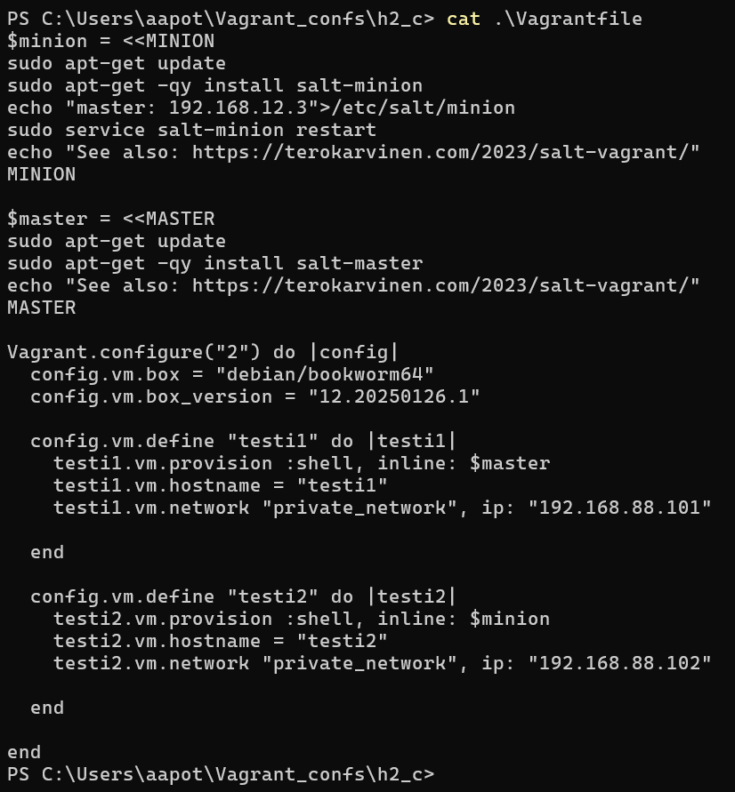

Teen kyseisen tiedoston pohjalta uudet virtuaalikoneet, joten komennolla `PS C:\Users\aapot\Vagrant_confs> mkdir h3` tein uuden hakemiston polkuun *C:\Users\aapot\Vagrant_confs*.

Seuraavaksi komennot

```
PS C:\Users\aapot\Vagrant_confs\h3> vagrant init #Alustaa vagrantin luomalla hakemistoon Vagrantfile-tiedoston

PS C:\Users\aapot\Vagrant_confs\h3> notepad.exe .\Vagrantfile #Avaa Vagrantfile-tiedoston notepadissä
```

Kopioin tiedot tiedostosta *h2_c\Vagrantfile* tiedostoon *h3\Vagrantfile*.

Latasin samalla valmiiksi itselleni saltin julkisen pgp-avaimen tuleviin debian-koneisiini, koska on parempi liittää avain erikseen vagrantin heredociin, kuin laittaa heredociin skripti julkisen avaimen lataamisesta.

Latasin avaimen osoitteesta: https://packages.broadcom.com/artifactory/api/security/keypair/SaltProjectKey/public

**11.4.2025 Klo 16.02**

Muokkasin *Vagrantfile*-tiedostoa, johon mm. lisäsin julkisen avaimen, curl-työkalun asennuksen, curlia hyödyntäen saltin repositorion lataamisen ja tallentamisen hakemistoon, minionille asetuksiin masterin IP-osoitteen ja saltin uudelleenkäynnistyksen. Kaikki nämä laitoin heredoc-skripteihini. Kerron näistä lisää kuvien yhteydessä.

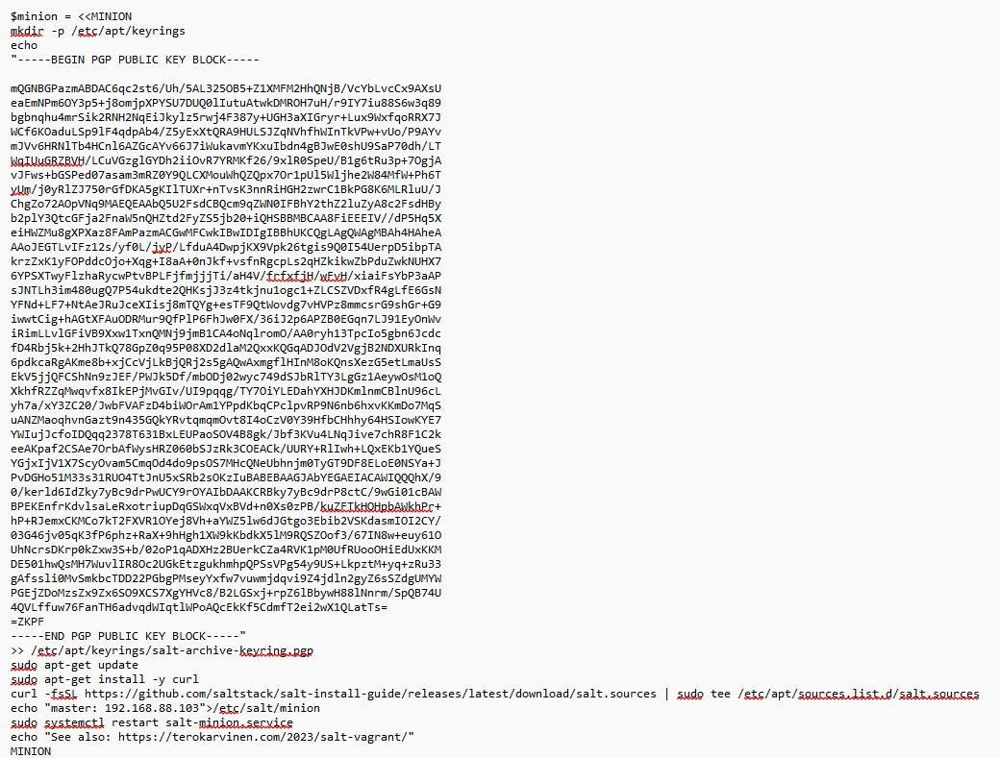

*Vagrantfilen* minion-skripti

Kuvassa:

```
mkdir -p /etc/apt/keyrings #Luodaan tiedosto (tai jos hakemisto on olemassa, ei tehdä mitään) polkuun /etc/apt/keyrings

echo ”(julkinen avain)” > /etc/apt/keyrings/salt-archive-keyring.pgp #Lisätään julkinen avain tiedostoon salt-archive-keyring.pgp

curl -fsSL https://github.com/saltstack/salt-install-guide/releases/latest/download/salt.sources | sudo tee /etc/apt/sources.list.d/salt.sources #Ladataan tiedostoon /etc/apt/sources.list.d/salt.sources saltin repositorio

echo "master: 192.168.88.103">/etc/salt/minion #Lisätään master-koneen IP-osoite tiedostoon /etc/salt/minion

sudo systemctl restart salt-minion.service #Käynnistetään salt-minion ohjelma uudestaan
```

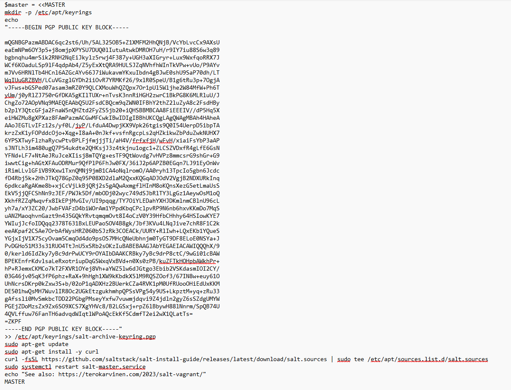

*Vagrantfilen* master-skripti

Kuvassa:

```
mkdir -p /etc/apt/keyrings #Luodaan tiedosto (tai jos hakemisto on olemassa, ei tehdä mitään) polkuun /etc/apt/keyrings

echo ”(julkinen avain)” > /etc/apt/keyrings/salt-archive-keyring.pgp #Lisätään julkinen avain tiedostoon salt-archive-keyring.pgp

curl -fsSL https://github.com/saltstack/salt-install-guide/releases/latest/download/salt.sources | sudo tee /etc/apt/sources.list.d/salt.sources #Ladataan tiedostoon /etc/apt/sources.list.d/salt.sources saltin repositorio

sudo systemctl restart salt-master.service #Käynnistetään salt-master ohjelma uudestaan
```

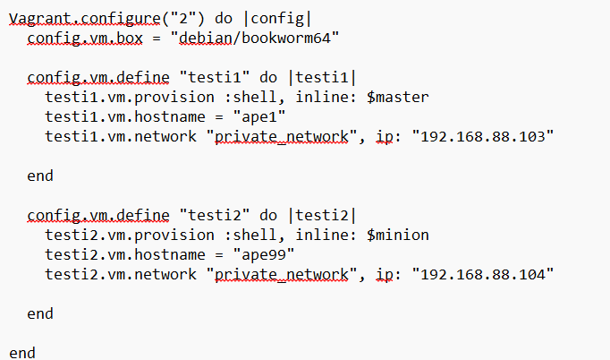

*Vagrantfilestä* loput tiedot

Kuvassa:

```
ape1.vm.network "private_network", ip: "192.168.88.103" #master-koneen ape1 IP-osoite

ape99.vm.network "private_network", ip: "192.168.88.104" #minion-koneen ape99 IP-osoite
```

**11.4.2025 Klo 16.44**

Seuraavana vaiheena oli komennolla `PS C:\Users\aapot\Vagrant_confs\h3> vagrant up` käynnistää koneet, joka onnistuikin, mutta lokeista näin heti, että salt-ohjelmien uudelleenkäynnistys ei ilmeisesti toiminut.

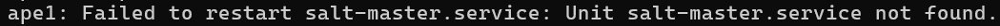

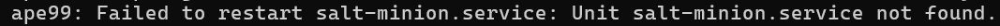

Molemmat koneet ovat ainakin käynnissä, koska tarkistin komennolla `PS C:\Users\aapot\Vagrant_confs\h3> vagrant status`.

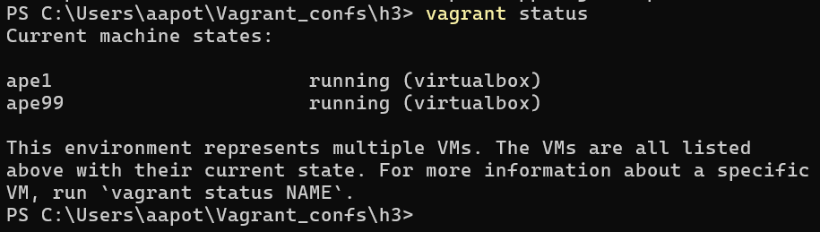

**11.4.2025 Klo 17.08**

SSH-yhteyden muodostus onnistui molempiin koneisiin. Salt ei ollut edes asentunut koneille, koska huomasin heti vianselvityksessä tiedoston *salt-archive-keyring.pgp * ammottavan tyhjyyttään, joten sudo vaaditaan näköjään echo komennon eteenkin vielä skripteissä. Alla kuva tyhjästä tiedostosta ja ilmoituksesta, että en voi kirjoittaa mitään tiedostoon (avasin tiedoston nanolla ilman root-oikeuksia).

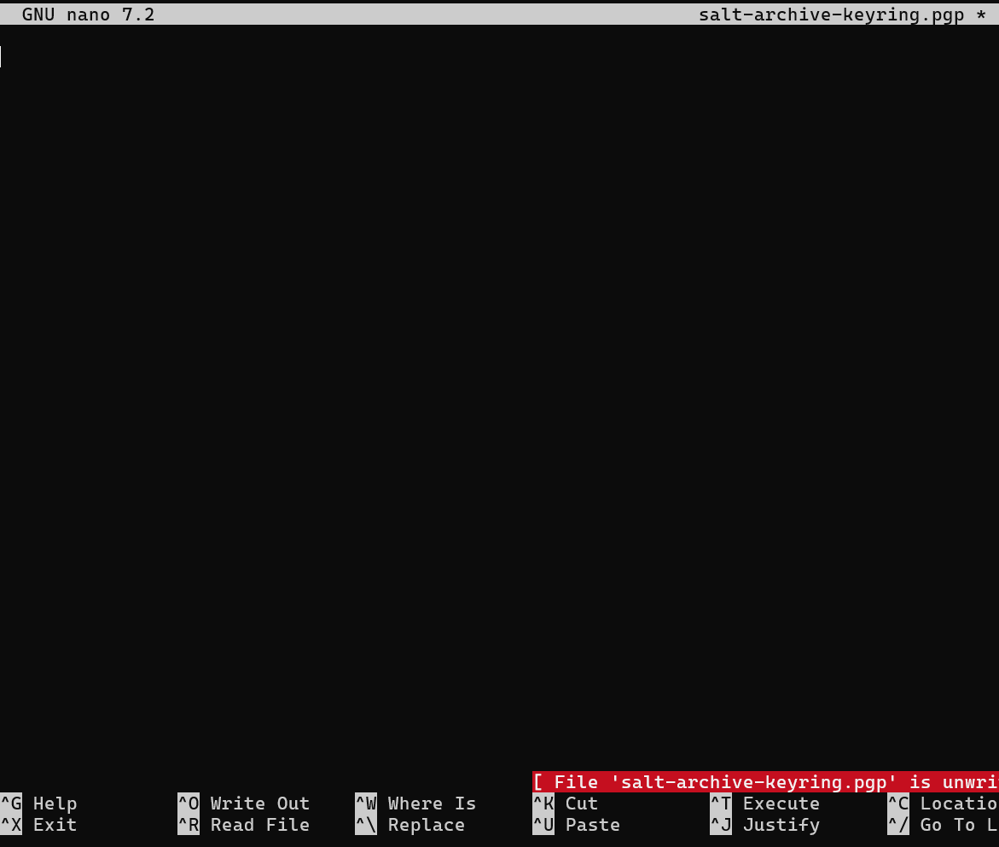

Komennolla `PS C:\Users\aapot\Vagrant_confs\h3> vagrant destroy` tuhosin koneet ja lähden muokkaamaan skriptejäni.

Alla on `sudo` lisättynä master- ja minion-skripteihin.

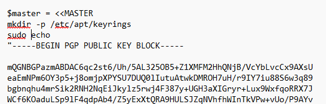

Yllä master-skripti

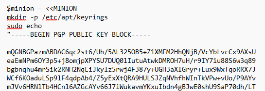

Yllä minion-skripti

Ei toiminut edelleenkään, vaan avainrengas oli edelleen tyhjä.

Löysin PhoenixNAP:n sivuilta artikkelin, jossa kerrottiin kuinka tehdä heredoc-skripti, joten sovelsin sitä  
(Dancuk 2022. URL: https://phoenixnap.com/kb/bash-heredoc).

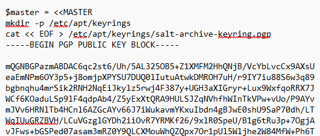

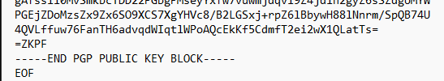

Yllä olevissa kuvissa:

```
cat << EOF > /etc/apt/keyrings/salt-archive-keyring.pgp #Kirjoittaa syötteen (tässä tapauksessa avaimen) tiedostopolkuun /etc/apt/keyrings/salt-archive-keyring.pgp (Jos tiedostoa ei ole valmiina, se luodaan samalla)  
#”EOF” on erotin, jolla pystytään havaitsemaan, mitä halutaan merkkijonon sisältävän
```

Tämän jälkeen avain oli lisätty, mutta saltia ei ollut asennettu kuitenkaan.

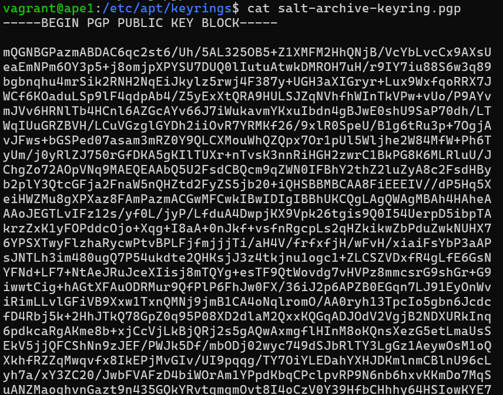

Alla olevassa kuvassa yritin tarkastaa saltin versiota master-koneeltani *ape1*.

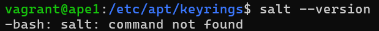

Annoin komennon

```
PS C:\Users\aapot\Vagrant_confs\h3> vagrant destroy #Tuhoaa virtuaalikoneet
```

**12.4.2025 Klo 10.30**

Muutin *Vagrantfile*-tiedostoa edelleen, koska huomasin, että minulta puuttui saltin repojen lataamisen jälkeen komennot, jolla päivitän uudestaan paketit ja ennen kaikkea, lataan salt-minion/salt-masterin. Muutosten jälkeen tiedostot näyttivät tältä:

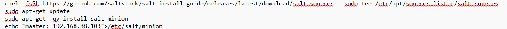

Kuvassa lisätty:

```
sudo apt-get update #Päivittää paketit

sudo apt-get -qy install salt-minion #Lataa ja asentaa salt-minion ohjelman
```

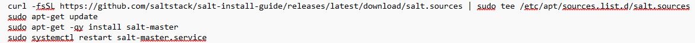

Kuvassa lisätty:

```
sudo apt-get update #Päivittää paketit

sudo apt-get -qy install salt-minion #Lataa ja asentaa salt-minion ohjelman
```

Tämän jälkeen *Vagrantfile*-tiedoston uudelleenlataaminen komennolla `PS C:\Users\aapot\Vagrant_confs\h3> vagrant reload --provision` ja koneet ylös komennolla `PS C:\Users\aapot\Vagrant_confs\h3> vagrant up`.

Tämän jälkeen salt löytyikin master-koneelta *ape1*.

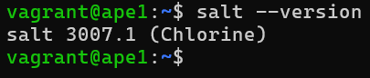

Minion-koneelta ei löytynyt jostain syystä saltin yleisversiota.

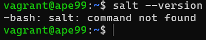

Mutta salt-minion löytyi kuitenkin. En tiedä mistä asia voisi johtua.

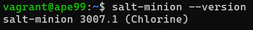

Master-koneelta löytyi kuitenkin minion-koneen avain, joten hyväksyin sen.

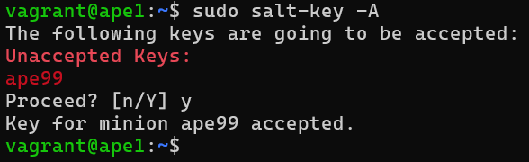

Kyseisessä tehtävässä ei tarvitsisi tosin master-minion verkkoa, koska tarkoitus on ajaa infrat koodina paikallisesti. Tulevissa tehtävissä kuitenkin tarvitsee master-minion verkon yli ajaa infraa koodina, joten loin sen jo tässä vaiheessa.

**12.4.2025 Klo 11.20**

Otin mallia moduulin luomisesta ja .sls-tiedoston luomisesta opettajan Tero Karvisen materiaaleista (URL: https://terokarvinen.com/2024/hello-salt-infra-as-code/).

Aloitin minion-koneellani lataamalla micro-tekstieditorin komennoilla

```
vagrant@ape99:~$ sudo apt-get update #Päivittää paketit

vagrant@ape99:~$ sudo apt-get -y install micro #Lataa ja asentaa micro-tekstieditorin

vagrant@ape99:~$ export EDITOR=micro #Lisää micro-editorin oletus tekstieditoriksi
```

**12.4.2025 Klo 11.31**

Seuraavaksi annoin komennot

```
vagrant@ape99:~$ sudo mkdir -p /srv/salt/hello/ #Luo hakemiston polkuun /srv/salt/hello/

vagrant@ape99:~$ cd /srv/salt/hello/ #Siirtyy hakemistopolkuun /srv/salt/hello/
```

Komennolla `vagrant@ape99:/srv/salt/hello$ sudoedit init.sls` loin ja avasin init.sls-tiedoston, johon tein konfiguroinnit hello-moduuliin.

Lisäsin alla olevan kuvan mukaiset tiedot tiedostoon.

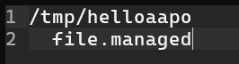

Kuvassa:

```
/tmp/helloaapo #Tiedostopolku, joka halutaan olevan olemassa (jos ei ole niin se luodaan)

file.managed #File-tilafunktio, jolla hallinnoidaan hakemistoja ja tiedostoja
```  
(VMware, Inc. URL: https://docs.saltproject.io/en/3006/ref/states/all/salt.states.file.html)

Yritin ajaa moduulin paikallisesti komennolla
```
vagrant@ape99:~$ sudo salt-call --local state.apply hello
```

mutta minulle tuli virheilmoitus.

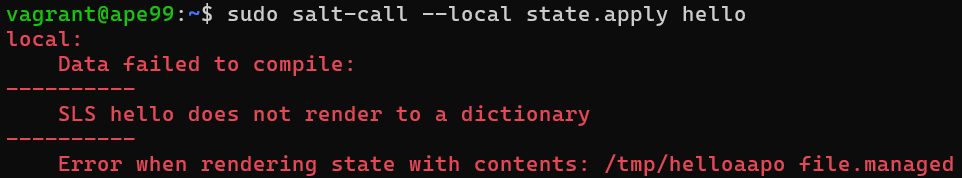

Luulen virheen johtuvan käännösvirheestä, koska virheilmoituksessa lukee, että *”SLS hello does not render to a dictionary”*.

Huomasin mahdollisen virheen, kun avasin init.sls-tiedoston uudestaan komennolla `sudoedit init.sls`. Minulta puuttui ”:” */tmp/helloaapo* tiedostopolun perästä, joten oletan käännösvirheen liittyvän YAML-kielen virheeseen, jossa YAML-muuntaja ei tunnistanut avain-arvo paria, jota muuntaa. Tavoitteenani olikin kirjoittaa init.sls-tiedostoon validia YAML-kieltä.

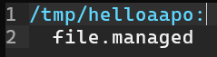

**12.4.2025 Klo 12.19**

Ajoin uudelleen komennon `vagrant@ape99:~$ sudo salt-call --local state.apply hello`, joka meni läpi ja tulosti halutun tuloksen näytölle.

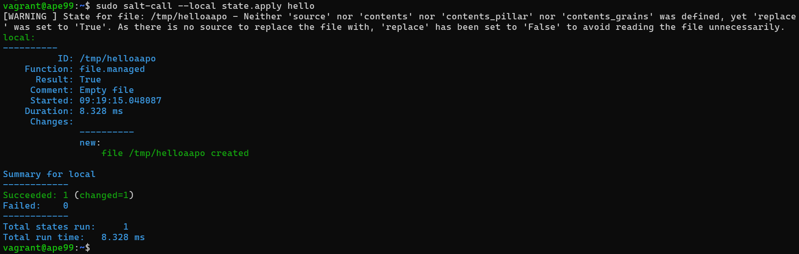

Kuvassa olennaisinta:

```
Changes: new: file /tmp/helloaapo created #Ilmoitti tiedoston /tmp/helloaapo luomisesta

Succeeded: 1 (changed=1) #1 toiminto on onnistunut ja yhden tila on muuttunut
```

Tarkastin edelleen, että tiedosto löytyi halutusta hakemistopolusta komennolla

```
vagrant@ape99:~$ ls /tmp/helloaapo
```

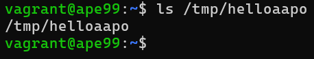

Ja sieltähän se löytyi.

Oli vuorossa idempotentin tarkastaminen vielä, joten komento
```
vagrant@ape99:~$ sudo salt-call --local state.apply hello #Vastauksena tulisi olla idempotentti tila jo ajettuun tilafunktioon
```

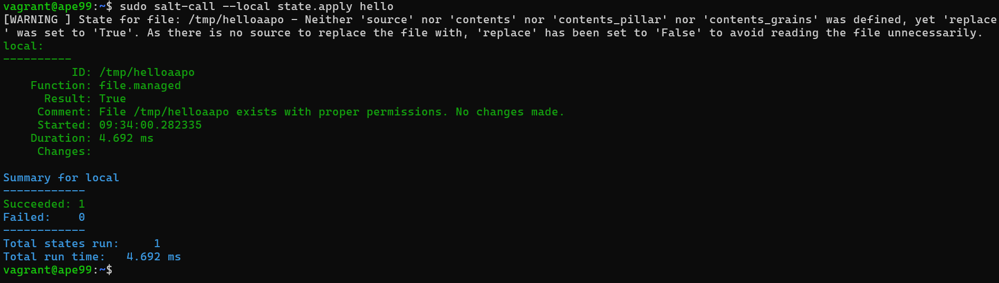

Tila oli idempotentti, koska

```
Comment: File /tmp/helloaapo exists with proper permissions. No changes made. #Ilmoitti tiedoston jo löytyvän koneelta haluamillani oikeuksilla

Changes: #Kohta oli tyhjä joten muutoksia ei ole tehty

Succeeded: 1 #Yksi onnistunut tilafunktion tarkastaminen, mutta ilman muutoksia (vertaa aiempaan ilmoitukseen, jossa muutoksia oli tapahtunut)
```

## b) Aja esimerkki sls-tiedostosi verkon yli orjalla.

**14.4.2025 Klo 11.20**

Aloitin tehtävän laittamalla samanlaiset virtuaalikoneet ylös, kuin aikaisemmin (kahden päivän tauko välissä, joten tuhosin aiemmin koneet komennolla `vagrant destroy`).

Joten siis komento `PS C:\Users\aapot\Vagrant_confs\h3> vagrant up`.

Tämän jälkeen master-koneella *ape1* avaimen hyväksyminen minion-koneelta komennolla `vagrant@ape1:~$ sudo salt-key -A`.

Asensin ensin micro-editorin ja loin sls-tiedoston uudelleen, koska sekin oli tietenkin hävinnyt tuhottuani koneet aikaisemmin. Tein muutenkin nyt toimenpiteet master-koneella *ape1* minion-koneen sijasta, koska aion ajaa komennot verkon yli enkä paikallisesti.

Komennot

```
vagrant@ape1:~$ sudo apt-get update #Päivittää paketit

vagrant@ape1:~$ sudo apt-get -y install micro #Lataa micro-tekstieditorin

vagrant@ape1:~$ export EDITOR=micro #Lisää micro-editorin oletus tekstieditoriksi

vagrant@ape1:~$ sudo mkdir -p /srv/salt/hello #Luo hakemistot (jos niitä ei ole jo valmiiksi)
```

Loin init.sls tiedoston hakemistopolkuun */srv/salt/hello* komennolla `vagrant@ape1:/srv/salt/hello$ sudoedit init.sls`.

Lisäsin tutun näköiset tiedot tiedostoon *init.sls*.

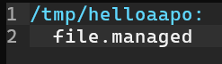

Seuraavaksi kävin minion-koneellani *ape99* varmistamassa, että siellä ei ole tiedostoa */tmp/helloaapo*, jotta voin tarkemmin todentaa komentamisprosessin.

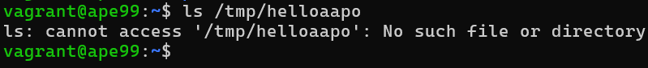

Tiedostoa ei ollut kuten ei pitänytkään olla.

Seuraavaksi annoin komennon

```
vagrant@ape1:~$ sudo salt "*" state.apply hello #Ajaa saltin avulla kaikilla minion-koneilla hello-moduulin
```

Vastaus oli odotusteni kaltainen, kuten alla näkyy.

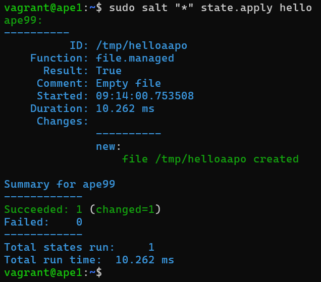

Kuvassa:

```
Changes: new: file /tmp/helloaapo created #Tiedosto luotiin, joten sitä ei ollut aikaisemmin

Succeeded: 1 (changed=1) #Yksi onnistunut suoritus ja yksi muuttunut tila, joten muutos on tapahtunut
```

Tämän jälkeen kävin tarkistamassa, että minion-koneellani *ape99* oli *helloaapo*-tiedosto luotuna ja siellähän se olikin.

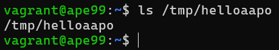

Ja vielä lisäksi tarkistin idempotentin.

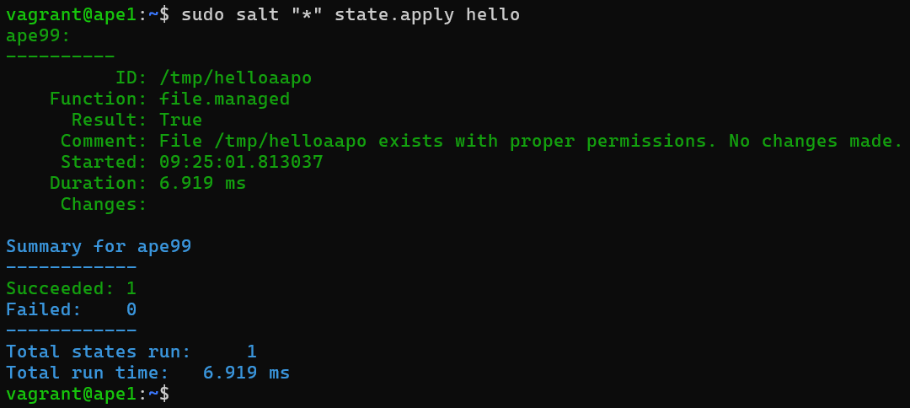

## c) Tee sls-tiedosto, joka käyttää vähintään kahta eri tilafunktiota näistä: package, file, service, user. Tarkista eri ohjelmalla, että lopputulos on oikea. Osoita useammalla ajolla, että sls-tiedostosi on idempotentti.

**14.4.2025 Klo 15.06**

Aikomukseni oli tehdä moduuli, joka lataa micro-tekstieditorin ja luo uuden käyttäjän, jonka nimi on ”paavo”.

Aloitin tehtävän luomalla uuden hakemiston moduulilleni, joten komentona `vagrant@ape1:~$ sudo mkdir -p /srv/salt/micro_userpaavo`.

Tämän jälkeen loin init.sls tiedoston komennolla `vagrant@ape1:/srv/salt/micro_userpaavo$ sudoedit init.sls`.

Lisäsin alla olevan kuvan mukaiset tiedot tiedostoon. Päättelin syntaksin aikaisemmista harjoituksista.

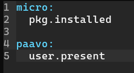

Kuvassa:

```
micro: pkg.installed #Lataa ja asentaa micro-tekstieditorin, jollei sitä ole jo aikaisemmin olemassa minion-koneilla

paavo: user.present #Luo käyttäjän ”paavo”, jollei sitä ole jo aikaisemmin olemassa minion-koneilla
```

Komennolla `vagrant@ape1:~$ sudo salt "*" state.apply micro_userpaavo` ajoin moduulin. Vastaukset komentoon ovat kuvina alla (vastaukset olivat pitkät, joten niistä on poimittu vain olennaisimmat).

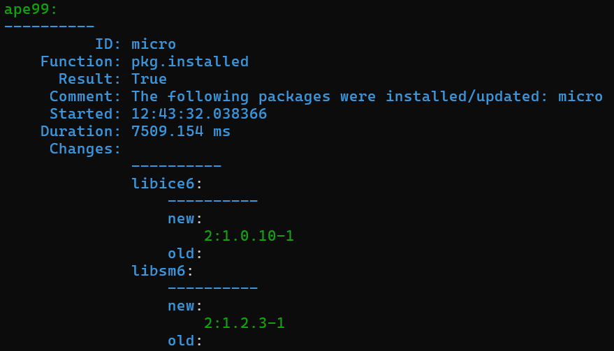

Kuvassa:

```
Comment: The following packages were installed/updated: micro #Muutoksia on tapahtunut, joten micro-tekstieditori asennettiin tai jos se oli jo olemassa minion-koneilla, niin se päivitettiin. Tarkemmat tiedot löytyvät ”Changes” kohdasta

Changes: … #Kohdassa näkyvät kaikki muutokset, jotka ovat tehty pkg-tilafunktiolla moduulistani. Kaikissa kohdissa oli ”new:” kohdassa jokin arvo ja ”old:” kohdissa ei ollut mitään arvoja, joten microa ei ollut entuudestaan minion-koneilla
```

Alla olevassa kuvassa on esitetty vastauksen loppu, joka tulee micro-editorin ”Changes”-kohdan jälkeen.

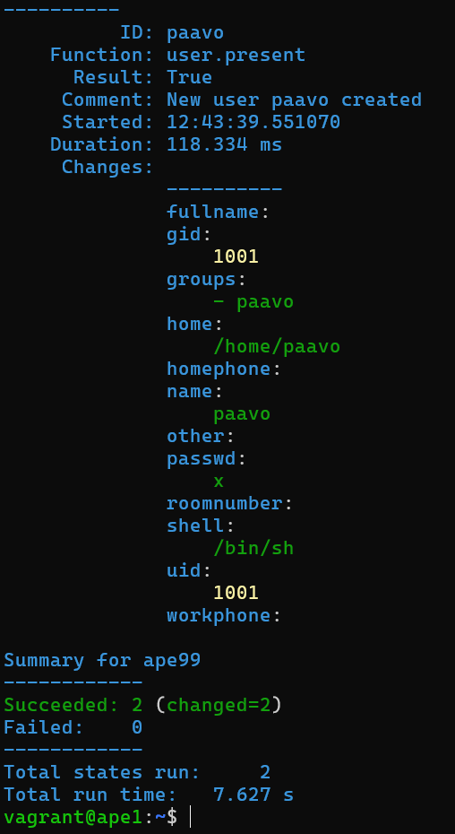

Kuvassa:

```
Comment: New user paavo created #Kertoo ”paavo” nimisen käyttäjän luomisesta

Changes: #Uuden paavo-käyttäjän tiedot listattuna

Succeeded: 2 (changed=2) #Kaksi onnistunutta suoritusta ja 2 muutosta tehty, joten tila ei ollut idempotentti
```

**14.4.2025 Klo 16.00**

Tarkastin cmd-tilafunktiolla, että muutokset ovat tehtynä. Komentona oli

```
vagrant@ape1:~$ sudo salt "*" state.single cmd.run 'micro --version' #Tarkastaa micro-editorin version, jolloin sen on pakko olla asennettuna palauttaessaan versionumeron
```

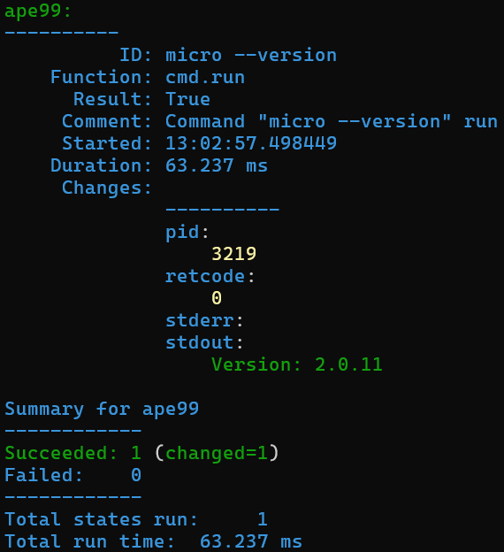

Vastauksessa palautui versionumero, joten micro on asennettuna minion-koneellani. Kuvassa huomionarvoista on, että `Succeeded` ja `changed` kohdissa on molemmissa arvona 1, koska cmd-tilafunktio ei ole idempotentti koskaan.

Ajoin saman komennon uudelleen, jolloin tuli täsmälleen sama vastaus, mutta ”pid”, eli prosessin tunnus, oli vain eri (ja tietysti ”Total run time”). Joten muutoksia tapahtuu aina kun ajetaan komentoja cmd-tilafunktiolla.

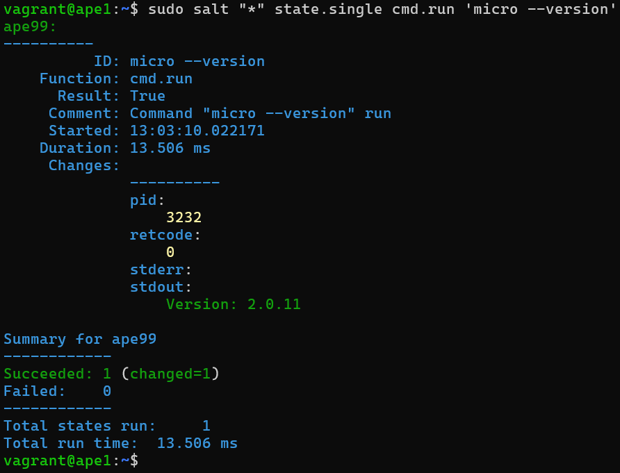

Seuraavaksi cmd-tilafunktiolla komento

```
vagrant@ape1:~$ sudo salt "*" state.single cmd.run 'cat /etc/passwd | grep paavo' #Tulostaa tiedoston /etc/passwd sisällön ruudulle ja putkittaa sen grepiin, jolla saan vain paavo-käyttäjän tiedot näytölle
```

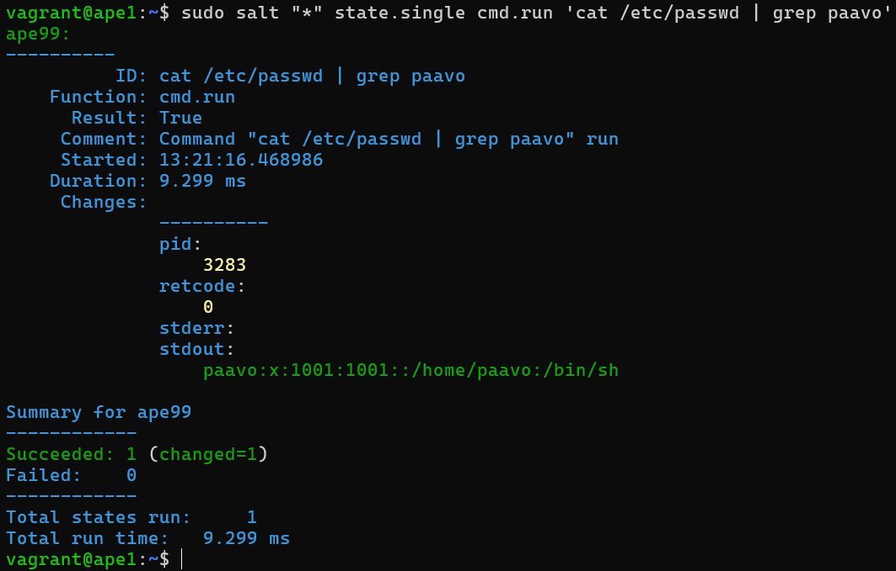

Kuvassa:

```
stdout: paavo:x:1001:1001::/home/paavo:/bin/sh #paavo-käyttäjän tiedot minion-koneen "ape99" tiedostosta /etc/passwd
```

Todistin vielä sls-tiedostoni minion-koneilla olevan idempotentti ajamalla uudestaan moduulini kaksi kertaa komennolla `vagrant@ape1:~$ sudo salt "*" state.apply micro_userpaavo`.

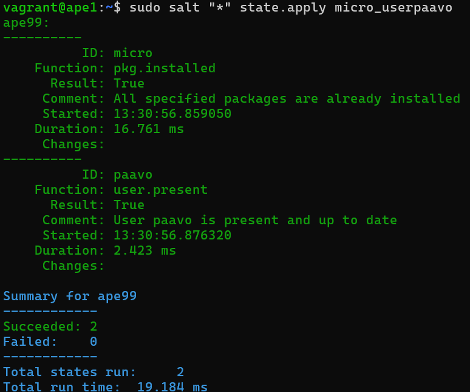

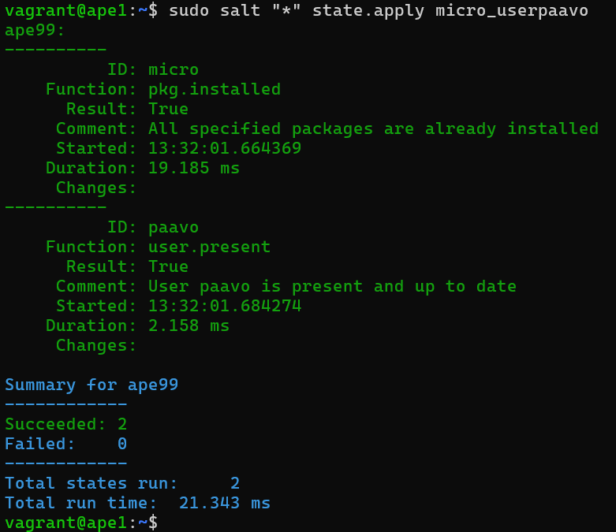

Kuvissa:

```
Comment: All specified packages are already installed #Kaikki paketit ovat jo asennettuna minion-koneilla/koneella. Tässä tapauksessa ainoa paketti on micro

Comment: User paavo is present and up to date #Käyttäjä ”paavo” on jo olemassa minion-koneilla/koneella ja käyttäjällä on samat tiedot, jotka on määritelty moduulissani (En ole erikseen määritellyt muita kuin nimen, joten tässä tapauksessa tiedot ovat oletustiedot)

Succeeded: 2 #Kaksi onnistunutta suoritusta. ”changed” kohtaa ei ole, joten mikään ei ole muuttunut
```

## Lähteet

Dancuk, M. 3.3.2022. Bash HereDoc Tutorial With Examples. Luettavissa: https://phoenixnap.com/kb/bash-heredoc. Luettu: 11.4.2025.

Karvinen, T. 3.4.2024. Hello Salt Infra-as-Code. Luettavissa: https://terokarvinen.com/2024/hello-salt-infra-as-code/. Luettu: 11.4.2025.

VMware, Inc. 19.3.2025. salt.states.file. Luettavissa: https://docs.saltproject.io/en/3006/ref/states/all/salt.states.file.html. Luettu: 12.4.2025.

VMware, Inc. Salt overview. Luettavissa: https://docs.saltproject.io/salt/user-guide/en/latest/topics/overview.html#rules-of-yaml. Luettu: 11.4.2025.
<br>
<br>
<br>
<br>
<br>
<br>
*Tätä dokumenttia saa kopioida ja muokata GNU General Public License (versio 3 tai uudempi) mukaisesti. http://www.gnu.org/licenses/gpl.html*
