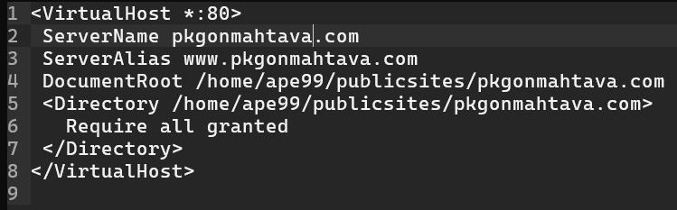
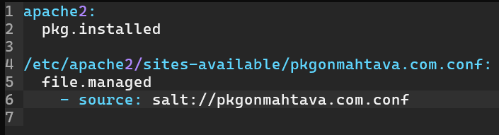
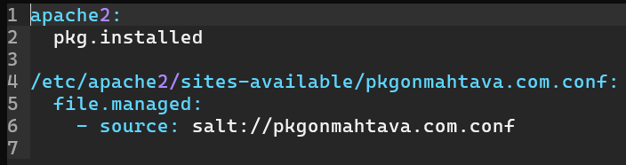
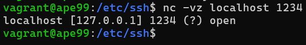
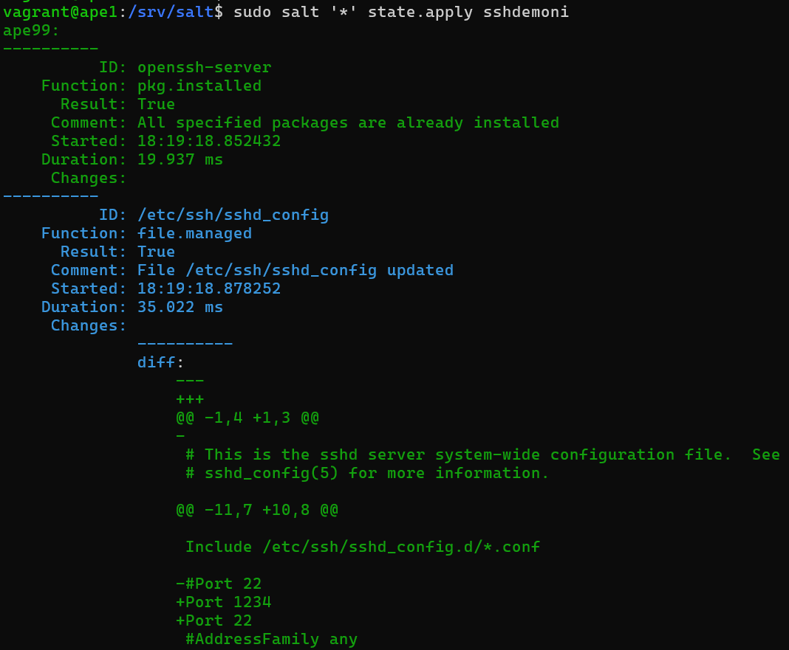
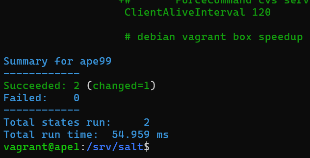

*Tekijä: Aapo Tavio*

*Pohjana Tero Karvinen 2025: Palvelinten Hallinta 2025 kevät, https://terokarvinen.com/palvelinten-hallinta/*

# h4 Pkg-file-service

## Käytettävän ympäristön ominaisuudet

- Isäntä
  >- HP Laptop 15s-eq3xxx  
  >- Microsoft Windows 11 Home (versio 24H2)  
  >- AMD Ryzen 7 5825U, Radeon Graphics  
  >- 16 GB RAM (15,3 GB käytettävissä)
  >- x64-pohjainen
  >- Verkkokorttina Realtek WiFi 6

- Paikalliset virtuaalikoneet
  >- Debian GNU/Linux 12 (bookworm)
 	>- Virtualbox ja Vagrant

## x) Lue ja tiivistä. (Tässä x-alakohdassa ei tarvitse tehdä testejä tietokoneella, vain lukeminen tai kuunteleminen ja tiivistelmä riittää. Tiivistämiseen riittää muutama ranskalainen viiva.)

### (Karvinen 2018. URL: https://terokarvinen.com/2018/04/03/pkg-file-service-control-daemons-with-salt-change-ssh-server-port/?fromSearch=karvinen%20salt%20ssh)

-	Package, file ja service ovat yleisimmät käytettävät tilafunktiot demonien automatisoinnissa saltin avulla
-	Prosessi menee yleensä siten, että ensiksi asennetaan ohjelma pkg-tilafunktiolla, tämän jälkeen konfiguraatiotiedoston muokkaaminen file-tilafunktiolla, lopuksi vielä demonin uudelleenkäynnistys service-tilafunktiolla

## a) Apache easy mode. Asenna Apache, korvaa sen testisivu ja varmista, että demoni käynnistyy.

### Apachen asentaminen käsin

**17.4.2025 Klo 9.01**

Aloitin laittamalla virtuaalikoneeni ylös vagrantilla, joten powershellissä komento
```
PS C:\Users\aapot\Vagrant_confs\h3> vagrant up #Käynnistää kaksi vagrant-virtuaalikonetta. Toisessa on salt-minion ja toisessa salt-master asennettuna
```
En tarvinnut tehtävässä master-slave arkkitehtuuria, joten aloitin tekemään minion-koneellani ”ape99” tehtävää. En myöskään hyväksynyt minion-avainta master-koneellani, vaikka minulla oli edellisestä h3-tehtävästä valmiina vagrant-tiedostossa skripti, jolla master-koneelle tuli minionin avain hyväksyttäväksi automaattisesti.

Joka tapauksessa komentona oli seuraavaksi
```
PS C:\Users\aapot\Vagrant_confs\h3> vagrant ssh ape99
```
Päivitin paketit ja asensin apache web-demonin
```
vagrant@ape99:~$ sudo apt-get update #Päivittää paketit
vagrant@ape99:~$ sudo apt-get install -y apache2 #Asentaa apache web-demonin. ”-y” valinta tarkoittaa, että kaikkiin tuleviin kysymyksiin vastataan myöntävästi asennuksen yhteydessä
```

### Oletus sivun ensimmäinen muutos

Kokeilin, että sivuni toimii localhost-osoitteessa
```
vagrant@ape99:~$ curl localhost #Hakee localhost-sivun, joka pyörii oletuksena apachella asentamisen jälkeen
```

Lopputuloksena sain oletussivun vastauksena, kuten alla olevista kuvista ilmenee.


Yllä olevassa kuvassa on alkuosa curlilla haetusta vastauksesta.


Yllä olevassa kuvassa puolestaan on oletussivun sisältöä vastauksena curlilla haettuun pyyntöön.

En voinut demonstroida apachen sivuja tehtävissä selaimen kautta ollenkaan, koska vagrant-koneessani ei ollut graafista käyttöliittymää, mutta curlilla sai kaiken oleellisen kuitenkin.

Minun piti tästä eteenpäin katsoa mallia aiemmasta tehtävästäni, jonka suoritin eri opintojaksossa (Tavio. URL: https://github.com/apeeqq/linux-servers/blob/main/h3-hello-web-server.md).

Vaihdoin ihan ensimmäiseksi oletussivun tekstin. Muistaakseni tämä kannatti tehdä, jotta pystytään viestimään pahantahtoisille toimijoille, että koneella ja demonilla ei olisi oletus asetuksia päällä. Komentona oli
```
vagrant@ape99:~$ echo "Default"|sudo tee /var/www/html/index.html #Oletussivu on tiedostopolussa ”/var/www/html/index.html”, jolloin sinne kirjoitetaan merkkijono ”Default”. ”tee” komennolla saadaan tulostettua näytölle myös sama merkkijono joka kirjoitetaan tiedostoon
```


Tarkistin asian vielä curlilla.
```
vagrant@ape99:~$ curl localhost
```


Asia näytti olleen kunnossa.

Mainittakoon kuitenkin, että kyseinen toimenpide ei tässä yhteydessä ole kovin relevantti, koska sivu on saatavilla vain paikallisesti. Toimenpide olisi relevantti lähinnä silloin, kun oletussivu olisi julkisesti saatavilla verkossa.

### Konfigurointitiedoston luominen verkkosivulle

**17.4.2025 Klo 10.03**

Hakemistopolussa */etc/apache2/sites-available* lähtötilanne oli alla olevan kuvan kaltainen.


Siellä oli vain oletussivut, kuten pitääkin.

Muistin tässä vaiheessa, että minulla ei ollut micro-tekstieditoria asennettuna, joten asensin sen ja laitoin sen oletus tekstieditoriksi.
```
vagrant@ape99:/etc/apache2/sites-available$ sudo apt-get update #Lataa paketit
vagrant@ape99:/etc/apache2/sites-available$ sudo apt-get install -y micro #Asentaa micro-tekstieditorin vastaten kaikkiin kysymyksiin myöntävästi asennuksen aikana
```

Palautin mieleeni, mitä web-sivun konfigurointitiedostoon kuuluikaan laittaa? Tähän käytin apuna opettajan Tero Karvisen materiaaleja  
(URL: https://terokarvinen.com/2018/04/10/name-based-virtual-hosts-on-apache-multiple-websites-to-single-ip-address/).

Ensimmäiseksi loin konfigurointitiedoston sivulleni
```
vagrant@ape99:/etc/apache2/sites-available$ sudoedit pkgonmahtava.com #Luo sudo-käyttäjänä tiedoston ”pkgonmahtava.com”
```

Laitoin tiedostoon alla olevan kuvan mukaiset tiedot.


”DocumentRoot” ja ”<Directory>” kohdissa olevat tiedostopolut eivät olleet vielä olemassa, mutta tein ne seuraavaksi.

Mutta tätä ennen huomasin konfigurointitiedostoni olevan vähän harhaanjohtava nimen perusteella. Laitoin vahingossa nimeksi ”pkgonmahtava.com”, vaikka olisi ollut hyvä laittaa ”pkgonmahtava.com.conf”. Joten vaihdoin nimen komennolla
```
vagrant@ape99:/etc/apache2/sites-available$ sudo mv pkgonmahtava.com pkgonmahtava.com.conf
```

### HTML-tiedoston luominen


**17.4.2025 Klo 11.12**

Loin hakemiston, johon tulee index.html-tiedostoni sivua varten, joten komento
```
vagrant@ape99:~$ mkdir -p /home/vagrant/publicsites/pkgonmahtava.com #Luo hakemistopolun kaikki hakemistot, jos niitä ei ole vielä luotu
```

Tarkastin onnistumisen komennolla
```
vagrant@ape99:~$ find publicsites/
```


Huomasin tosiaan tässä vaiheessa, että kotihakemistoni ei olekaan ”ape99”, vaan ”vagrant”, joten kävin muuttamassa konfigurointitiedostoon polut oikeiksi. Alla kuva.


Komennolla
```
vagrant@ape99:~/publicsites/pkgonmahtava.com$ micro index.html
```
loin tiedoston, johon kirjoitan html-koodia. Tulos oli alla olevan kuvan kaltainen.


Jatkoin komennolla
```
vagrant@ape99:/etc/apache2/sites-available$ sudo a2ensite pkgonmahtava.com.conf #Laittaa ”pkgonmahtava.com.conf”-tiedoston päälle hakemistoon ”sites-enabled”
```

Vielä edelleen oletussivun konfigurointitiedosto pois päältä komennolla
```
vagrant@ape99:/etc/apache2/sites-available$ sudo a2dissite 000-default.conf
```

Ja näiden jälkeen apachen uudelleenkäynnistys komennolla
```
vagrant@ape99:/etc/apache2/sites-available$ sudo systemctl restart apache2
```

Näytti onnistuvan, koska ensiksi listasin hakemiston */etc/apache2/sites-enabled* sisällön.


Ja toisekseen kokeilin curlilla, että onnistuin.


Vastauksena curliin sain luomani index.html-tiedostoni sisällön, joten asia oli kunnossa. Pidin tauon, joten annoin komennon
```
PS C:\Users\aapot\Vagrant_confs\h3> vagrant halt #Sammuttaa virtuaalikoneet, mutta ei tuhoa niitä
```

### Apachen poistaminen minion-koneelta

**17.4.2025 Klo 13.57**

Aloitin tauon jälkeen tarkastamalla, että curlilla tuli localhost-osoitteesta uusi sivuni ja listaamalla hakemiston */etc/apache2/sites-enabled*, jossa tulee olla vain tiedosto ”pkgonmahtava.com.conf”. Näin olikin, joten jatkoin eteenpäin.

Seuraavaksi aloin tekemään omaa moduulia, jolla automatisoin minionille sls-tiedoston avulla toteutetut toimenpiteet. Ennen sitä poistin apachen minion-koneeltani, koska ilman poistamista tila olisi jo saavutettu, eli idempotentti.

Mietin, että voisin tuhota vain virtuaalikoneet ja laittaa tuoreet ylös. Tehtävän ohjeissa luki kuitenkin ”Käsin tehty ja toimii” sekä ”Poistettu käsin tehty ennen automaatiota”, joten ajattelin samalla koneella tehtävän tekemisen olleen ehkä tarkoitettu. Lähinnä sen vuoksi, että varmistetaan ensin käsin, että kyseisellä koneella apache varmasti toimii, joten silloin pitäisi samalla koneella tehdä.

Joka tapauksessa aloitin selvittämällä, miten apache poistetaan oikeaoppisesti, koska en tiennyt kuuluuko käyttää `remove` vai `purge` komentoa. Vaiko molempia. Löysinkin asiasta sivun, josta ymmärsin voivani käyttää vain `purge` komentoa, jolloin poistettaisiin kaikki binäärit ja konfigurointitiedostot  
(Stack Exchange Inc. URL: https://stackoverflow.com/questions/68635646/what-are-the-differences-between-apt-clean-remove-purge-etc-commands).

Annoin komennon  
```
vagrant@ape99:~$ sudo apt-get purge apache2
```
jolla poistin apachen, mutta minulle tuli virheilmoitus poistettaessa.


Kuvassa näkyy, että tekemäni konfigurointitiedosto on olemassa vielä, kun listasin hakemistopolun */etc/apache2/sites-available*. Listasin vielä polun */etc/apache2/*, jossa oli vain *sites-available* hakemisto olemassa, joten `purge` komento taisi poistaa kaikki muut tiedot, paitsi ilmoitetut. Nämä ovat konfigurointitiedostoja molemmat, joten oletin voivani käydä vain poistamassa kyseiset tiedostot.

Ensiksi poistin tiedoston ”pkgonmahtava.com.conf”, komennolla
```
vagrant@ape99:/etc/apache2/sites-available$ sudo rm pkgonmahtava.com.conf
```

jonka jälkeen poistin hakemistot *sites-available* ja *apache2* komennoilla
```
vagrant@ape99:/etc/apache2$ sudo rm -r sites-available/ #Komentoihin oli laitettava ”-r” valinta, jotta voi poistaa hakemiston
vagrant@ape99:/etc$ sudo rm -r apache2/
```

Ja sama oletussivun konfiguraatiotiedostolle ja hakemistoille
```
vagrant@ape99:/var/www/html$ sudo rm index.html
vagrant@ape99:/var/www$ sudo rm -r html/
vagrant@ape99:/var$ sudo rm -r www/
```

Poistin jokaisen yksitellen, koska poistaminen on aina riskialtista. Jos vaan on aikaa, niin katson yksitellen, mitä poistettavissa hakemistoissa ja tiedostoissa on?

### Apachen asentaminen saltin avulla

**17.4.2025 Klo 14.57**

Kirjauduin master-koneelleni ”ape1”, jolla tein sls-tiedoston apachen asennukseen.

Hyväksyin minion-koneen avaimen master-koneella ensimmäiseksi.


Komennolla
```
vagrant@ape1:~$ sudo mkdir -p /srv/salt/apassi_palvelin #Luo hakemistot, jos niitä ei ole aikaisemmin olemassa
```
tein moduulilleni hakemiston.

Minulla ei ollutkaan taaskaan micro-editoria, joten komennot
```
vagrant@ape1:/srv/salt/apassi_palvelin$ sudo apt-get update #Päivittää paketit
vagrant@ape1:/srv/salt/apassi_palvelin$ sudo apt-get install -y micro #Lataa ja asentaa micro-tekstieditorin
vagrant@ape1:/srv/salt/apassi_palvelin$ export EDITOR=micro # Lisää micro-editorin oletus editoriksi
```

Komennolla
```
vagrant@ape1:/srv/salt/apassi_palvelin$ sudoedit init.sls
```
loin moduulini tiedoston, johon kirjoitan konfiguraatioita.

Ymmärsin tehtävän vinkeistä, että olisi hyvä laittaa yksi palanen kerrallaan konfiguraatiotiedostoon ja ajaa se välillä. Muutenkin komennot ovat tilafunktioita, joten niitä ei suoriteta, jos tila on idempotentti.

Lisäsin siis seuraavanlaiset tiedot tiedostoon ”init.sls”.


Komennon pitäisi asentaa minionille/minioneille apache-demoni.

En tiennyt pitikö paketit päivittää konfigurointitiedoston avulla vai ei, mutta opettajan ssh-palvelin esimerkissä ei päivitetty paketteja. Päättelin näin ollen, että paketit voi päivittää ilman omaa moduulia. Toisaalta tuli mieleen, että palvelimilla on usein automaattiset päivitykset, jolloin paketteja ei tarvitse manuaalisesti päivittää ennen asennusta (ehkä?).

Ajoin kuitenkin komennon
```
vagrant@ape1:~$ sudo salt * cmd.run "sudo apt-get update" #Päivittää apt-paketit minion-koneilla
```
jolla päivitin minion-koneen paketit.


Yllä olevassa kuvassa näkyy, kuinka ”ape99” koneelle päivitettiin paketit.

Ajoin tämän jälkeen moduulini ”apassi_palvelin” komennolla
```
vagrant@ape1:~$ sudo salt * state.apply apassi_palvelin
```

Sain vastaukseksi viestin, jonka luulin enteilevän ainakin hyvää.


Kuvassa
```
”Comment: The following packages were installed/updated: apache2” #Apache demoni asennettiin tai päivitettiin
”Changes: (…)” #Apache asennettiin, eikä päivitetty, koska ”new:” kohdassa oli tietoa ja ”old:” kohdassa ei
”Succeeded: 1 (changed=1)” #Yksi onnistunut suoritus ja yksi muutos tapahtunut
```

Kävin katsomassa ensin minion-koneeltani, löytyykö apache sieltä. Listasin ensin apachen sivut.


Näytti oikein hyvältä. Sitten kokeilin curlilla localhostia.


Sekin näytti oikein hyvältä ja toivotulta.

Tarkastin vielä idempotentin.


Vastauksessa ei näkynyt muutoksia, joten idempotentti oli.

Tässä vaiheessa tauko, joten komentona oli
```
PS C:\Users\aapot\Vagrant_confs\h3> vagrant halt
```

### File-tilafunktion hyödyntäminen moduulissa

**18.4.2025 Klo 11.23**

Jatkoin lisäämällä tietoja omaan moduuliini ”apassi_palvelin”.

Komennolla
```
vagrant@ape1:/srv/salt/apassi_palvelin$ sudoedit init.sls #Avaa init.sls tiedoston microon
```
avasin init.sls-tiedoston uudelleen.

Yritin soveltaa aiempaa tehtävääni tähän konfigurointitiedostoon, jotta saisin luotua tiedoston polkuun */etc/apache2/sites-available* ja lisättyä siihen automaattisesti haluamani konfigurointitiedot.  
(Tavio. URL: https://github.com/apeeqq/Configuration-management-systems/blob/main/h1-viisikko.md)

Lisäsin tiedostoon alla olevan kuvan mukaiset tiedot, joten nyt moduulin piti asentaa apache ja luoda tiedosto ”pkgonmahtava.com.conf” polkuun */etc/apache2/sites-available/*.


Ajoin komennon
```
vagrant@ape1:/srv/salt/apassi_palvelin$ sudo salt * state.apply apassi_palvelin
```
mutta sain virheilmoituksen, joka näkyy alla.


Näyttää, että minionia ei tavotettaisi, mutta katsoin, että avain on hyväksyttyjen listalla master-koneella.

Yritin pingata master-konetta, minion-koneella, mutta ei onnistunut.


Käynnistin molemmat demonit uudelleen komennoilla
```
vagrant@ape1:/srv/salt/apassi_palvelin$ sudo systemctl restart salt-master.service #Käynnistää salt-masterin uudelleen
vagrant@ape99:~$  sudo systemctl restart salt-minion.service #Käynnistää salt-minionin uudelleen
```
mutta siltikään ei toiminut.

Tämän jälkeen sain toimimaan, koska huomasin logiikan, miten salt toimii? Jos ajan saltia kotihakemistossani, voin laittaa wildcard(*)-merkin, jolla ilmaisen haluamani minionit, ilman lainausmerkkejä tai heittomerkkejä. Mutta ajaessani ainakin polusta */srv/salt/apassi_palvelin* minun piti sisällyttää lainaus/heittomerkit wildcardiin. Alla kuvat havainnollistamaan tilannetta.


Yllä olevassa kuvassa ajettuna "apassi_palvelin" hakemistossa heittomerkein ja ilman.


Yllä olevassa kuvassa taas puolestaan kotihakemistossa ajettu salt heittomerkein ja ilman.

Ajoin uudestaan komennon
```
vagrant@ape1:~$ sudo salt * state.apply apassi_palvelin
```
joka vaikutti tuottavan halutun tuloksen.


Kuvassa funktiot ovat eroteltuna ID:n perusteella. ”ID: apache2” osiossa
```
Comment: All specified packages are already installed #Kaikki paketit ovat jo valmiiksi asennettuna
```

”ID: /etc/apache2/sites-available/pkgonmahtava.com.conf” osiossa
```
Changes: new: file /etc/apache2/sites-available/pkgonmahtava.com.conf created #Ilmaisee ”pkgonmahtava.com.conf” tiedoston luomisesta, joten sitä ei ollut aiemmin olemassa
```

Yhteenvedossa kaksi onnistunutta suoritusta ja vain yksi muutos, koska paketti oli asennettuna, mutta tiedostoa ei ollut olemassa.

Kävin minionilla tarkistamassa tuloksen, joten komentona
```
vagrant@ape99:~$ ls /etc/apache2/sites-available/pkgonmahtava.com.conf #Listaa polun /etc/apache2/sites-available/pkgonmahtava.com.conf, jos se on olemassa
```

Vastauksen perusteella tiedosto on luotu.


Komento
```
PS C:\Users\aapot\Vagrant_confs\h3> vagrant halt
```
koska pidin tauon.

### Tekstin lisääminen tiedostoon file-tilafunktion avulla

**19.4.2025 Klo 11.53**

Koneet ylös komennolla
```
PS C:\Users\aapot\Vagrant_confs\h3> vagrant up
```

Komennolla
```
vagrant@ape1:/srv/salt/apassi_palvelin$ sudoedit init.sls
```
lähdin muuttamaan tiedostoa edelleen.

Laitoin tiedostoon ”file.managed” alle ”-contents=…”, jolla halusin saada kyseiset rivit luotuun tiedostoon. Kuva alla.


Komentona
```
vagrant@ape1:/srv/salt/apassi_palvelin$ sudo salt '*' state.apply apassi_palvelin
```

Sain kuitenkin virheilmoituksen.


Oletin syntaksissa olevan jotain vikaa välilyönteihin liittyen virheilmoituksen perusteella.

### Konffitiedosto master-koneelle

Huomasin opettajan sivuilta ja tehtävien ohjeista, että konfigurointitiedosto pitäisikin tehdä ilmeisesti master-koneelle ja sieltä kopioida minioneille.  
(URL: https://terokarvinen.com/2018/04/03/pkg-file-service-control-daemons-with-salt-change-ssh-server-port/?fromSearch=karvinen%20salt%20ssh)

Joten tein uuden konfigurointitiedoston komennolla
```
vagrant@ape1:/srv/salt$ sudoedit pkgonmahtava.com.conf
```

Konfigurointitiedostosta tuli alla olevan kuvan mukainen



**19.4.2025 Klo 12.48**

Huomasin, että minulla oli nyt väärässä paikassa konfigurointitiedostossa, koska se oli polussa */srv/salt/pkgonmahtava.com.conf* ja sen olisi pitänyt olla polussa */srv/salt/apassi_palvelin/pkgonmahtava.com.conf*.

Muutin tiedoston sijaintia komennolla
```
vagrant@ape1:/srv/salt$ sudo mv /srv/salt/pkgonmahtava.com.conf /srv/salt/apassi_palvelin/ #Siirtää tiedoston polkuun /srv/salt/apassi_palvelin/
```


Kävin muuttamassa moduulini init.sls-tiedostoa uudelleen ja lopputuloksena oli alla olevan kuvan mukainen tiedosto.



Kuvassa
```
- source: salt://pkgonmahtava.com.conf #Hakee master-koneelta luomani konfigurointitiedoston minion-koneen konfigurointitiedostoon master-koneen salt-hakemistosta
```

Edelleen antoi virheilmoituksen, mutta erilaisen.


Huomasin, että minun kuuluisi lisätä kaksoispiste ”file.managed” perään. Alla lisättynä.



Tällä kertaa komento
```
vagrant@ape1:/srv/salt/apassi_palvelin$ sudo salt '*' state.apply apassi_palvelin
```
ajettiin onnistuneesti muuten, mutta kommenteissa luki, että master-koneelta ei löydy konfigurointitiedostoa.


Koitin vaihtaa polun muodosta *salt://pkgonmahtava.com.conf* muotoon */srv/salt/apassi_palvelin/pkgonmahtava.com.conf*.

Mutta silti ei löytänyt tiedostoa.


### Ongelman ratkaiseminen

**19.4.2025 Klo 18.57**

Lähdin selvittelemään ongelmaa hakemalla tietoa netistä. Katsoin tarkemmin opettajan materiaalia ssh-portin muuttamisesta, jossa ”- source” valinta esiintyy. Tein huomion, että ”- source” kohdassa polku oli samaa muotoa, kuin mitä ensimmäiseksi kokeilin. Lisäksi löysin saltin virallisilta sivuilta artikkelin polun määrittämisestä.  
(URL: https://docs.saltproject.io/en/3006/ref/file_server/environments.html)

Näin ollen päättelin opettajan esimerkissä olleen polun osoittavan */srv/salt* hakemistoon, kun itse yritin viitata samalla komennolla hakemistoon */srv/salt/apassi_palvelin*. Todennäköisesti konfigurointitiedostot on hyvä olla *salt* hakemistossa, koska opettajakin on näin tehnyt. Toki se on loogistakin, koska moduulia ajetaan saltilla moduulin hakemiston nimellä.

Joten annoin komennon
```
vagrant@ape1:/srv/salt/apassi_palvelin$ sudo mv /srv/salt/apassi_palvelin/pkgonmahtava.com.conf /srv/salt/ #Siirtää pkgonmahtava.com.conf hakemistopolkuun /srv/salt.
```

Ja vielä tarkistus


Siellä oli kuten pitikin.

Sitten oli vuorossa tuttu komento, jolla ajoin moduulini
```
vagrant@ape1:/srv/salt/apassi_palvelin$ sudo salt '*' state.apply apassi_palvelin
```

Vastaus näytti lupaavalta, kuten alla olevasta kuvasta ilmenee.


Kuvassa
”ID: apache2 kohdassa”
```
Comment: All specified packages are already installed #Paketit olivat jo asennettu, eli apache2
```

”ID: /etc/apache2/sites-available/pkgonmahtava.com.conf” kohdassa
```
Comment: File /etc/apache2/sites-available/pkgonmahtava.com.conf updated #Jo olemassa oleva konfigurointitiedosto päivitettiin
Changes: diff: --- +++ (…) #Näytettiin muutokset, jotka tehtiin. Tässä yhteydessä kirjoitettiin tiedostoon haluamani teksti master-koneen tiedostosta, joka näkyy kohdassa vihreällä
```

Yhteenvedossa
```
Succeeded: 2 (changed=1) #Kaksi onnistunutta suoritusta ja yksi muutos tehty. Huomionarvoista on, että vain kaksi suoritusta on olemassa, joten tiedoston olemassaolo ja teksti ovat saman file-tilafunktion suorituksessa mukana
```

Tarkastin minion-koneelta, että kaikki on kunnossa.
```
vagrant@ape99:~$ cat /etc/apache2/sites-available/pkgonmahtava.com.conf
```


Ja kaikkihan oli kunnossa, koska tiedostossa oli haluamani teksti.

### Index-tiedoston luominen ja lisääminen moduuliin

**19.4.2025 Klo 19.28**

Tein seuraavaksi html-kielellä tiedoston master-koneelleni, jolta samalla tavalla kuin aiemmin ”- source” valinnan avulla, otan haluamani sisällön index.html-tiedostoon, joka tehdään minion-koneelle.

Komento
```
vagrant@ape1:/srv/salt$ sudoedit pkgonmahtava.com
```

Ja tiedostoon alla olevan kuvan mukaiset tiedot.


Ja edelleen komento
```
vagrant@ape1:/srv/salt$ sudoedit apassi_palvelin/init.sls #Avaa sudona init.sls tiedoston
```

Lisäsin alla olevan kuvan mukaiset tiedot.


Kuvassa
```
/home/vagrant/publicsites/pkgonmahtava.com: #Tiedostopolku, jonka halusin luoda minion-koneelle
file.managed: #Käytettävä tilafunktio
- source: salt://pkgonmahtava.com #HTML-kielellä kirjoitettu tiedosto, jonka sisältö kopioidaan luotavaan tiedostoon minion-koneelle
```

Seuraavaksi moduulin ajo komennolla
```
vagrant@ape1:~$ sudo salt '*' state.apply apassi_palvelin
```

Ja virheilmoitus jälleen kerran.


Ilmoitti näköjään luotavan tiedoston olevan hakemisto, vaikka se pitäisi olla tiedosto. Tajusin heti, että minunhan piti lisätä index.html tiedosto polun perään.

Lopputulos näkyy alla.


Sitten tulikin taas haluttua vastausta. Vastaus alkoi olla niin pitkä, että otin vain loppupätkän siitä.


Kuvassa
```
Comment: File /home/vagrant/publicsites/pkgonmahtava.com/index.html updated #Tiedosto päivitettiin onnistuneesti
Changes: diff: --- +++ (…) #Muutokset, jotka tehtiin. Tässä lisättiin haluamani tiedoston teksti, joka näkyy vastauksessa
Succeeded: 3 (changed=1) #Kolme onnistunutta suoritusta ja yksi muutos tehty
```

Ja vielä tarkastus minion-koneella komennolla
```
vagrant@ape99:~$ cat publicsites/pkgonmahtava.com/index.html #Tulostaa näytölle index.html tiedoston
```


Kaikki oli taas mainiosti, ainakin toistaiseksi.

### Sivujen laittaminen päälle/pois

**19.4.2025 Klo 20.15**

Oli vuorossa apachen oletussivun poistaminen hakemistosta */etc/apache2/sites-enabled/* ja oman konfiguraatiotiedoston lisääminen sinne.

Katsoin saltin virallisilta sivuilta, että apacheen pitäisi olla oma moduulinsa saatavilla, joten kokeilin sitä.  
(URL: https://docs.saltproject.io/en/3006/ref/modules/all/salt.modules.deb_apache.html)

Init.sls tiedosto alla olevan kuvan mukaiseksi.


Kuvassa
```
000-default.conf: apache.a2dissite #Laittaa sivun ”000-default.conf” pois päältä
pkgonmahtava.com.conf: apache.a2ensite #Laittaa sivun ”pkgonmahtava.com.conf” päälle
```

Sitten koitin ajaa moduulin, mutta virheilmoitus jälleen.


Ilmeisesti apache-moduuli ei jostain syystä toimi.

Ajattelin kokeilla ”apache.a2dissite” sijaan ”apache.a2disconf” sekä ”apache.a2ensite” tilalla ”apache.a2enconf”.


Ja taas moduulin ajaminen. Mutta virheilmoitus edelleen.


### File.symlink

**20.4.2025 Klo 11.11**

Tutkiessani ongelmaa, löysin opettajan Tero Karvisen sivuilta artikkelin, jossa on ilmeisesti käytetty ”file.symlink” tilafunktiota suorittamaan samantapaista ongelmaa. Toisaalta siinä on käsitelty apachen modeja.  
(URL: https://terokarvinen.com/2018/04/03/apache-user-homepages-automatically-salt-package-file-service-example/)

Varmistin saltin omilta sivuilta, mitä ”file.symlink” tekee. Se luo näköjään symbolisia linkkejä.  
(URL: https://docs.saltproject.io/en/3006/ref/states/all/salt.states.file.html#salt.states.file.symlink)

Päätin kokeilla kyseistä tilafunktiota ja soveltaa opettajan esimerkkiä itselleni.

Alla kuva init.sls tiedostosta jälleen.


Kuvassa
```
/etc/apache2/sites-enabled/000-default.conf: file.absent #Poistaa oletus sivun päältä poistamalla tiedoston ”000-default.conf” hakemistosta ”sites-enabled”
/etc/apache2/sites-enabled/pkgonmahtava.com.conf: file.symlink: - target: /etc/apache2/sites-available/pkgonmahtava.com.conf #Tekee symbolisen linkin polusta ”/etc/apache2/sites-enabled/pkgonmahtava.com.conf” polkuun ”/etc/apache2/sites-available/pkgonmahtava.com.conf:”
```

Sitten ajoin moduulini. Vastaus ilmoitti onnistumisesta ainakin. Kuva on taas vastauksen loppuosasta.


Kuvassa
”ID: /etc/apache2/sites-enabled/000-default.conf” kohdassa
```
Comment: Removed file /etc/apache2/sites-enabled/000-default.conf
Changes: removed: /etc/apache2/sites-enabled/000-default.conf
#Molemmissa kohdissa ilmoitetaan, että tiedosto ”000-default.conf” on poistettu hakemistosta ”/etc/apache2/sites-enabled/”
```

”ID: /etc/apache2/sites-enabled/pkgonmahtava.com.conf” kohdassa
```
Comment: Created new symlink /etc/apache2/sites-enabled/pkgonmahtava.com.conf -> /etc/apache2/sites-available/pkgonmahtava.com.conf #Uusi symbolinen linkki tehty
Changes: new: /etc/apache2/sites-enabled/pkgonmahtava.com.conf #Tehdyt muutokset, tässä tapauksessa polkuun ”/etc/apache2/sites-enabled/” on luotu tiedosto ”pkgonmahtava.com.conf”
```

Yhteenvedossa
```
Succeeded: 5 (changed=2) #Viisi onnistunutta suoritusta ja kaksi muutosta tehty
```

**20.4.2025 Klo 12.03**

Kävin tarkastamassa minion-koneellani muutoksia ja lupaavalta ainakin näytti.


Hakemistosta *sites-enabled* löytyi toivotusti konfigurointitiedostoni haluamallani sisällöllä.

Lisäksi hakemistosta *sites-enabled* oli poistettu oletus sivun tiedosto.


Curlilla tuli vielä apachen oletus sivu, kuten kuuluikin, koska en ole käynnistänyt apachea uudelleen.

Tehtävänannossa lukee, että ei tarvisi ”-watch” valintaa käyttää, koska ”index.html” ei ole konfigurointitiedosto. En kuitenkaan löytänyt netistä, miten apachen saisi ilman watchia uudelleenkäynnistettyä?

Minulla olisi muutama vaihtoehto. Joko käyttää ”cmd.run” funktiota, jolla voisin ajaa moduulissani uudelleenkäynnistyksen. Toinen vaihtoehto olisi ajaa moduulin jälkeen manuaalisesti ”cmd.run” hyväksikäyttäen uudelleenkäynnistys. Kolmas olisi käyttää watchia ja linkittää se konfigurointitiedostoon hakemistossa *sites-available*. Kolmannessa vaihtoehdossa minun pitäisi kuitenkin manuaalisesti uudelleenkäynnistää apache yhden kerran, koska tiedosto ei muutu enää.

### Service-tilafunktio

**20.4.2025 Klo 14.33**

Päätin kokeilla watch-menetelmää. Lukiessani raporttiani uudelleen, huomasin tehneen virheen myös aikaisemmin, koska ”pkgonmahtava.com.conf” tiedostossa minulla oli polku */home/**ape99**/publicsites/pkgonmahtava.com* vaikka olisi kuulunut olla */home/**vagrant**/publicsites/pkgonmahtava.com*. Korjasin tämän.

Seuraavaksi muokkasin init.sls tiedostoani alla olevan kuvan mukaiseksi.


Kuvassa
```
apache_restart: #Suorituksen tunniste eli ID
service.running #Käytettävä tilafunktio
- name: apache2 #Demonin nimi, jota halutaan kontrolloida
- watch: #Valinta, jolla seurataan tiettyä ehtoa ja jos ehto ei ole idempotentti, käynnistetään demoni uudelleen
- file: /etc/apache2/sites-available/pkgonmahtava.com.conf #Tiedosto, jota halutaan tarkkailla muutoksien varalta
```

Sitten taas moduulini ajaminen. Läpi meni ja vastaus näytti ihan hyvältä.


Kuvassa kuusi onnistunutta suoritusta ja ei yhtään muutosta, koska kuten aiemmin sanoin, tiedosto oli jo idempotentti.

Sitten komento
```
vagrant@ape1:/srv/salt/apassi_palvelin$ sudo salt '*' cmd.run 'sudo systemctl restart apache2'
```
jolla käynnistin apachen minioneilla (minionilla) uudelleen.

Vastaus oli toivotunlainen, eli vain minion-koneen nimi tuli näkyviin, koska onnistuneesta uudelleenkäynnistyksestähän ei tulekkaan mitään ilmoitusta.


Ja sitten tarkastus minion-koneelta curlilla.


Ja sehän toimi kuten pitikin!

Minulle tuli kuitenkin itse asiassa mieleeni, että voisikohan ”service.disabled” ja ”service.enabled” avuilla saada ilman watchia käynnistettyä apache uudelleen. Koitin siten ja sekin onnistui!

Ensimmäiseksi muutin ”pkgonmahtava.com” tiedostoa, jotta voin nähdä toimiiko muutokset curl-komentoa hyödyntäen.


Vaihdoin paragraph-elementiksi rivin z-merkkejä.

Tämän jälkeen vaihdoin sls-tiedostoon ”service.disabled” ja ”service.enabled” tilafunktiot korvaamaan ”cmd.run” tilafunktion.


Ajoin moduulini.


Ja curlilla localhost.


Toimii!

## b) SSHouto. Lisää uusi portti, jossa SSHd kuuntelee.

### Käsin testaaminen

**20.4.2025 Klo 20.02**

Ensiksi pitää testata ilman saltia, joten aloitin touhut minion-koneellani.

Komennolla
```
vagrant@ape99:/etc/ssh$ nc -vz localhost 1234 #Käyttää netcat-ohjelmaa tarkastaakseen localhost osoitteen porttinumeron 1234 saavutettavuuden. ”-v” valinta tarkoittaa, että vastauksessa on lisää verbaalista palautetta suorituksesta ja ”-z” valinta kertoo, että vain yhteyden tila tarkastetaan, mutta yhteyttä ei luoda
```
tarkastin, että saadaanko yhteyttä oman minion-koneen porttiin, jonka numero oli 1234.  
(Dancuk. URL: https://phoenixnap.com/kb/nc-command)


Yhteyttä ei saatu, joten voin konfiguroida portin numeroon 1234.

Jatkoin muokkaamalla konfigurointitiedostoa komennolla
```
vagrant@ape99:/etc/ssh$ sudoedit sshd_config
```

Otin kommentti merkin pois ”Port 22” edestä ja lisäsin sen yläpuolelle rivin ”Port 1234”, jolla saan molemmat portit 22 ja 1234 auki.


Käynnistin ssh:n uudelleen komennolla
```
vagrant@ape99:/etc/ssh$ sudo systemctl restart sshd
```
jonka jälkeen tuttu komento netcatilla.



Portti oli nyt auki.

### Saltin käyttäminen ssh:n porttien hallintaan

**20.4.2025 Klo 20.54**

En poistanut tässä vaiheessa ssh-demonia, koska en olisi saanut muuten mahdollisesti ollenkaan yhteyttä koneeseen, joten muutin konfigurointitiedoston alkuperäiseen muotoon. Portti 22 oli vain siis auki tällöin.


Uudelleenkäynnistys
```
vagrant@ape99:/etc/ssh$ sudo systemctl restart sshd
```

Ja netcat.


Portti 1234 oli kiinni, kuten pitikin.

Aloitin tekemällä uuden moduulin master-koneelleni, komennolla
```
vagrant@ape1:/srv/salt$ sudo mkdir sshdemoni #Luo hakemiston nimeltä ”sshdemoni”.
```

Oikeasta paikasta hakemisto löytyikin.


Tämän jälkeen loin uuden sls-tiedoston komennolla
```
vagrant@ape1:/srv/salt/sshdemoni$ sudoedit init.sls
```
ja lisäsin alla olevan kuvan mukaiset tiedot.


Kuvassa
```
openssh-server: #Paketin nimi, joka halutaan ladata
pkg.installed #Kyseinen paketti ladataan ja asennetaan, jos sitä ei ole jo valmiiksi ladattuna ja asennettuna
```

Ajoin moduulini
```
vagrant@ape1:/srv/salt/sshdemoni$ sudo salt '*' state.apply sshdemoni
```


Kuvassa
```
Comment: All specified packages are already installed #SSH on asennettu jo valmiiksi, kuten kuuluikin olla
Succeeded: 1 #Yksi onnistunut suoritus ilman muutoksia
```

### File-tilafunktio ssh-moduuliin

Sitten oli vuorossa file-tilafunktion hyödyntäminen muokkaamalla sls-tiedostoa.


Kuvassa
```
/etc/ssh/sshd_config: #Tiedostopolku, joka halutaan, että on minion-koneilla olemassa
file.managed: #Käytettävä tilafunktio
- source: salt://ssh_dem_conf  #SSH konfigurointitiedosto, josta haluan ottaa tekstin minion-koneen konfigurointitiedostoon (en ole vielä luonut tätä tiedostoa)
```

Loin master-koneelle konfigurointitiedoston, jota halusin käyttää lähteenäni (- source).
```
vagrant@ape1:/srv/salt$ sudoedit ssh_dem_conf
```

Lisäsin tiedostoon identtisesti oletustiedoston kaltaisen tekstin, mutta otin taas kommenttimerkin pois ”Port 22” tekstin edestä ja lisäsin rivin ”Port 1234”.


Ja moduulin ajo.



Kuvassa (kuva vain alkuosasta vastausta)
```
Comment: File /etc/ssh/sshd_config updated #Minion-koneen ssh-konfigurointitiedosto päivitettiin, koska siinä ei ollut porttia 1234 auki
Changes: (…) #Muutokset, jotka tehtiin. Tapauksessa lisättiin master-koneeni ”ssh_dem_conf” tiedoston sisältö
```

Alla loppuosa vastauksesta.



Kuvassa
```
Succeeded: 2 (changed=1) #Kaksi onnistunutta suoritusta. Vain yksi muutos, joka oli konfigurointitiedosto
```

Tässä vaiheessa kokeilin netcatilla, että portti on vielä kiinni, koska uudelleenkäynnistystä ei ole tehty.


Kiinni oli.

### Service-tilafunktio moduuliin

Sitten vielä service-tilafunktio sls-tiedostoon.


Kuvassa
```
sshd: #Demoni, jota halutaan tarkastella/käsitellä
service.running: #Käytettävä tilafunktio
- watch: - file: /etc/ssh/sshd_config #Pyydetään seuraamaan minion-koneen ssh-konfigurointitiedostoa. Jos tiedosto muuttuu, ssh käynnistetään uudelleen
```

Ajoin moduulin.


Vastauksessa
```
Comment: The service sshd is already running #SSH:ta ei käynnistetty uudelleen, koska aikaisemmalla moduulin ajolla tiedosto oli jo valmiiksi oikeassa tilassa. Demoni kuitenkin on käynnissä kuten pitääkin.
Succeeded: 3 #Kolme onnistunutta suoritusta. Ei yhtään muutoksia tapahtunut.
```

Edelleenkin minulla oli portti 1234 kiinni, koska demonia ei oltu käynnistetty uudelleen.


Käynnistin demonin uudelleen muokkaamalla master-koneen konffitiedostoa. Otin ensiksi portin 1234 pois tiedostosta ja ajoin moduulin. Loppuosa vastauksesta kuvana alla.


Ja tämän jälkeen lisäsin uudestaan portin 1234 masterin konffitiedostoon, sekä ajoin moduulin. Loppuosa vastauksesta alla.


Muutoksia oli kaksi, koska konffitiedosto oli muuttunut ja demoni käynnistettiin uudelleen.

Sitten netcatilla tarkastus.


Ja portti oli auki, kuten kuuluikin!

### SSH-yhteyden ottaminen master-koneelta minion-koneelle

Kokeilin vielä lopuksi ottaa yhteyden master-koneelta ssh:n avulla minion-koneelle. Tallensin salaisen avaimeni ensin master-koneelle ”ape1”. Avaimen kopioin vagrantin tiedostoista host-koneeltani.


Ja sitten ssh-yhteys toimikin mainiosti minion-koneelle ”ape99”.


Kuvassa
```
ssh #Käytettävä protokolla
vagrant@192.168.88.104 #Halutaan kirjautua käyttäjällä ”vagrant”, joka sijaitsee ip-osoitteessa ”192.168.88.104”
-p 1234 #Halutaan ottaa yhteys tiettyyn porttiin, joka tässä tapauksessa on 1234
-i /key #Halutaan ottaa identifioimistieto polusta /key
```

(Lähteenä ssh:n ohjeet komennolla ”man ssh”)

### Openssh-serverin poistaminen ja moduulin ajaminen

**21.4.2025 Klo 9.49**

Ajattelin vielä kokeilla poistamalla openssh-serverin minion-koneeltani ja sen jälkeen ajaa master-koneellani moduulini.

Aloitin poistamalla minion-koneelta openssh-serverin.


Tämän jälkeen yritin ottaa yhteyttä windows-koneeltani minion-koneelleni, mutta se ei onnistunut. Tämä olikin tavoiteltu tila.


Ja ei onnistunut master-koneeltakaan yhteys minion-koneeseen ssh:n avulla.


Ajoin moduulini master-koneelta.

Alla kuva vastauksen alku osasta.


Kuvassa
”ID: openssh-server” kohdassa
```
Comment: (…) #openssh-server asennettiin
Changes: (…) #Muutoksissa lukee uusi openssh-serverin versio, joten sitä ei ollut ennestään, koska kohta ”old:” oli tyhjä.
```

”ID: /etc/ssh/sshd_config” kohdassa
```
Comment: (…) #sshd_config tiedosto minion-koneella päivitettiin
Changes: (…) #Rivit, jotka lisätty ja poistettu sshd_config tiedostosta/tiedostoon
```

Alla kuva loppuvastauksesta.


Vastauksessa
```
Comment: #SSH demoni käynnistettiin uudelleen
Succeeded: 3 (changed=3) #Kolme onnistunutta suoritusta ja kolme muutosta
```

Yritin seuraavaksi kirjautua master-koneelta ssh-yhteyden avulla minion-koneelle.


Ei onnistunut, koska ilmoitti ilmeisesti tiivisteen muuttumisesta.

Ajoin komennon, jolla poistin vanhat tunnistautumistiedot muistista
```
vagrant@ape1:~/.ssh$ ssh-keygen -f "/home/vagrant/.ssh/known_hosts" -R "[192.168.88.104]:1234"
```

Yritin uudestaan aivan samalla avaimella ja tiedostolla kirjautua. Tällä kertaa onnistui.


Kokeilin myös windows-koneestani ottaa yhteyden, joka toimi myös normaalisti.


Lopuksi poistin turvallisuus syistä *key* tiedoston, joka sisälsi yksityisen avaimen.

<br>
<br>
<br>
<br>

## Lähteet

Dancuk, M. 24.5.2022. nc Command (Netcat) with Examples. Luettavissa: https://phoenixnap.com/kb/nc-command. Luettu: 20.4.2025.

Karvinen, T. 3.4.2018. Apache User Homepages Automatically – Salt Package-File-Service Example. Luettavissa: https://terokarvinen.com/2018/04/03/apache-user-homepages-automatically-salt-package-file-service-example/. Luettu: 20.4.2025.

Karvinen, T. 3.4.2018. Pkg-File-Service – Control Daemons with Salt – Change SSH Server Port. Luettavissa: https://terokarvinen.com/2018/04/03/pkg-file-service-control-daemons-with-salt-change-ssh-server-port/?fromSearch=karvinen%20salt%20ssh. Luettu: 16.4.2025.

Karvinen, T. 10.4.2018. Name Based Virtual Hosts on Apache – Multiple Websites to Single IP Address. Luettavissa: https://terokarvinen.com/2018/04/10/name-based-virtual-hosts-on-apache-multiple-websites-to-single-ip-address/. Luettu: 17.4.2025.

SSH-ohjelman ohjeet komentoriviltä. man ssh. Luettu: 20.4.2025.

Stack Exchange Inc. What are the differences between apt clean/remove/purge etc. commands?. Luettavissa: https://stackoverflow.com/questions/68635646/what-are-the-differences-between-apt-clean-remove-purge-etc-commands. Luettu: 17.4.2025.

Tavio, A. h1 Viisikko. Luettavissa: https://github.com/apeeqq/Configuration-management-systems/blob/main/h1-viisikko.md. Luettu: 18.4.2025.

Tavio, A. h3 Hello Web Server. Luettavissa: https://github.com/apeeqq/linux-servers/blob/main/h3-hello-web-server.md. Luettu: 17.4.2025.

VMware, Inc. 19.3.2025. Requesting Files from Specific Environments. Luettavissa: https://docs.saltproject.io/en/3006/ref/file_server/environments.html. Luettu: 19.4.2025.

VMware, Inc. 19.3.2025. salt.modules.deb_apache. Luettavissa: https://docs.saltproject.io/en/3006/ref/modules/all/salt.modules.deb_apache.html. Luettu: 20.4.2025.

VMware, Inc. 19.3.2025. salt.states.file. Luettavissa: https://docs.saltproject.io/en/3006/ref/states/all/salt.states.file.html#salt.states.file.symlink. Luettu: 20.4.2025.
<br>
<br>
<br>
<br>
<br>
<br>
*Tätä dokumenttia saa kopioida ja muokata GNU General Public License (versio 3 tai uudempi) mukaisesti. http://www.gnu.org/licenses/gpl.html*
