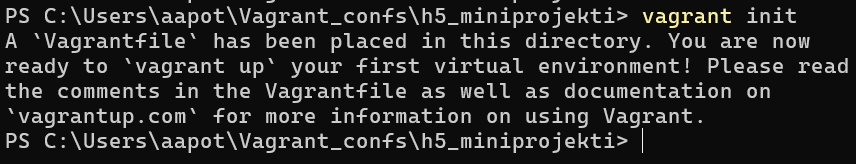
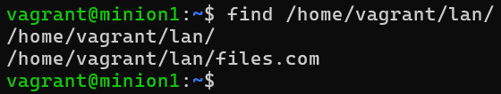
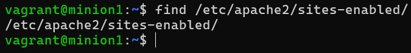

*Tekijä: Aapo Tavio*  
*Pohjana Tero Karvinen 2025: Palvelinten Hallinta 2025 kevät, https://terokarvinen.com/palvelinten-hallinta/*

# h5 Miniprojekti

## Käytettävän ympäristön ominaisuudet

- Isäntä
  >- HP Laptop 15s-eq3xxx  
  >- Microsoft Windows 11 Home (versio 24H2)  
  >- AMD Ryzen 7 5825U, Radeon Graphics  
  >- 16 GB RAM (15,3 GB käytettävissä)
  >- x64-pohjainen
  >- Verkkokorttina Realtek WiFi 6

- Paikalliset virtuaalikoneet
  >- Debian GNU/Linux 12 (bookworm)
 	>- Virtualbox ja Vagrant

## a) Oma miniprojekti.

### Vagrant

**2.5.2025 Klo 10.53** 

Loin ensimmäiseksi projektilleni oman hakemiston, johon saan luotua vagrant-tiedoston projektin virtuaalikoneita varten. Komentona

```
PS C:\Users\aapot\Vagrant_confs> mkdir h5_miniprojekti #Luo uuden hakemiston windows-host koneelleni
```

Seuraavaksi alustin luomani hakemiston vagrantille.



Lisäsin ”Vagrantfile” konfigurointitiedostoon alla olevat tiedot (Kaikki kuvat ovat samaa tiedostoa, mutta oli pakko pilkkoa kuvat osiin).


Kuvassa

```
sudo apt-get update #Päivittää paketit  
sudo apt-get install -y ufw #Asentaa ufw-palomuurin  
sudo ufw allow 22/tcp #Määrittää palomuurin konfigurointiin tiedon, jolla avataan portti 22 sisään ja ulos (sisältää ipv4 ja ipv6), johon otetaan yhteyttä host-koneelta  
sudo ufw --force enable #Laittaa palomuurin päälle ei-interaktiivisesti  (Stack Exchange Inc. URL: https://unix.stackexchange.com/questions/488033/understanding-the-combination-of-ufw-force-enable)  
mkdir -p /etc/apt/keyrings #Luodaan hakemisto (tai jos hakemisto on olemassa, ei tehdä mitään) polkuun /etc/apt/keyrings  
cat << EOF > /etc/apt/keyrings/salt-archive-keyring.pgp #Kirjoittaa syötteen (tässä tapauksessa avaimen) tiedostopolkuun /etc/apt/keyrings/salt-archive-keyring.pgp (Jos tiedostoa ei ole valmiina, se luodaan samalla)  #”EOF” on erotin, jolla pystytään havaitsemaan, mitä halutaan merkkijonon sisältävän
```


Kuvassa

```
sudo apt-get update #Päivittää paketit  
sudo apt-get install -qy curl #Asennetaan curl-ohjelma  
curl -fsSL https://github.com/saltstack/salt-install-guide/releases/latest/download/salt.sources | sudo tee /etc/apt/sources.list.d/salt.sources #Ladataan tiedostoon /etc/apt/sources.list.d/salt.sources saltin repositorio  
sudo apt-get -qy install salt-minion #Lataa ja asentaa salt-minion ohjelman  
echo "master: 192.168.88.105">/etc/salt/minion #Lisätään master-koneen IP-osoite tiedostoon /etc/salt/minion  
sudo systemctl restart salt-minion.service #Käynnistetään salt-minion ohjelma uudestaan  
```


Kuvassa

```
sudo apt-get update #Päivittää paketit  
sudo apt-get install -y ufw #Asentaa ufw-palomuurin  
sudo ufw allow 22/tcp #Määrittää palomuurin konfigurointiin tiedon, jolla avataan portti 22 sisään ja ulos (sisältää ipv4 ja ipv6), johon otetaan yhteyttä host-koneelta  
sudo ufw --force enable #Laittaa palomuurin päälle ei-interaktiivisesti  (Stack Exchange Inc. URL: https://unix.stackexchange.com/questions/488033/understanding-the-combination-of-ufw-force-enable)  
mkdir -p /etc/apt/keyrings #Luodaan hakemisto (tai jos hakemisto on olemassa, ei tehdä mitään) polkuun /etc/apt/keyrings  
cat << EOF > /etc/apt/keyrings/salt-archive-keyring.pgp #Kirjoittaa syötteen (tässä tapauksessa avaimen) tiedostopolkuun /etc/apt/keyrings/salt-archive-keyring.pgp (Jos tiedostoa ei ole valmiina, se luodaan samalla)  #”EOF” on erotin, jolla pystytään havaitsemaan, mitä halutaan merkkijonon sisältävän
```


Kuvassa

```
sudo apt-get update #Päivittää paketit  
sudo apt-get install -y curl #Asennetaan curl-ohjelma  
curl -fsSL https://github.com/saltstack/salt-install-guide/releases/latest/download/salt.sources | sudo tee /etc/apt/sources.list.d/salt.sources #Ladataan tiedostoon /etc/apt/sources.list.d/salt.sources saltin repositorio  
sudo apt-get -qy install salt-master #Lataa ja asentaa salt-master ohjelman  
sudo systemctl restart salt-master.service #Käynnistetään salt-master ohjelma uudestaan  
master.vm.network "private_network", ip: "192.168.88.105" #master-koneen IP-osoite  
minion1.vm.network "private_network", ip: "192.168.88.106" #minion-koneen ”minion1” IP-osoite  
```

Komennolla

```
PS C:\Users\aapot\Vagrant_confs\h5_miniprojekti> vagrant up
```

koneet ylös.

### Tavoite ja perusrunko

**2.5.2025 Klo 15.38**

Otin tavoitteekseni rakentaa moduulin, joka asentaa apache web-palvelimen ja tarjoilee tiedostoja lähiverkossa oleville laitteille sitä kautta. Ajattelin tämän olevan hieman poikkeavampi kuin aikaisemmat tehtävät, mutta ilman ylisuuria ponnisteluja saavutettavissa.

Löysinkin sivun, jossa kerrottiin apachen web-palvelimen käyttämisestä tiedostopalvelimena  
(GeeksforGeeks. URL: https://www.geeksforgeeks.org/how-to-share-files-on-local-network-using-apache-file-server/).

Aloitin tehtävän tekemällä rungon, joka koostuu perustoiminnoista. Tämän rungon pidän varmuuskopiona, jonka päälle lähden rakentamaan monimutkaisempia konfiguraatioita.

Aivan ensimmäiseksi yritin hyväksyä master-koneelta minion-koneen avaimen saltiin, mutta se ei onnistunut. Huomasinkin, että portit 4505 ja 4506 pitävät olla auki master-koneella, jotta voidaan kommunikoida minion-koneiden kanssa. Muutin siis Vagrantfile-tiedoston palomuurin asetuksia alla olevan kuvan mukaiseksi. Ja lisätyt portit vain masterin skriptiin.  
(VMware, Inc. URL: https://docs.saltproject.io/salt/install-guide/en/latest/topics/before-you-start/check-network-ports.html)


**3.5.2025 Klo 10.45**

Aloitin hyväksymällä minion-koneen avaimen master-koneelta.


Edelleen jatkoin luomalla hakemiston moduulilleni komennolla

```
vagrant@master:/srv$ sudo mkdir -p /srv/salt/fileserver
```

Ja tarkastin vielä, että se löytyy.


Tein moduuliin sls-tiedoston komennolla

```
vagrant@master:/srv/salt/fileserver$ sudoedit init.sls
```

Lisäsin tiedostoon alla olevan kuvan mukaiset tiedot, joilla saan apachen asennettua minion-koneelleni.


Ja moduulin ajaminen komennolla

```
vagrant@master:/srv/salt/fileserver$ sudo salt '*' state.apply fileserver
```

Vaikutti tulevan toivottu lopputulos.


Yllä vastauksen ensimmäinen osa.


Yllä kuva vastauksen loppuosasta.

Kävin tarkastamassa, että apache on asennettu minion-koneelle tulostamalla sen version. Ja siellähän se olikin kuten pitääkin.


### Konfigurointitiedosto apachelle

**3.5.2025 Klo 11.23**

Jatkoin edelleen lisäämällä konfigurointitiedoston master-koneelleni moduulini hakemistoon komennolla

```
vagrant@master:/srv/salt/fileserver$ sudoedit files.com.conf
```

Lisäsin alla olevan kuvan mukaiset tiedot tiedostoon.


Lisäsin vielä alla olevan kuvan mukaiset tiedot init.sls-tiedostoon.


Kuvassa

```
/etc/apache2/sites-available/files.com.conf #Tiedostopolku joka luodaan minion-koneelle  
file.managed #Käytettävä tilafunktio  
- source : salt://fileserver/files.com.conf #Tiedostopolku master-koneella, josta haetaan tiedot minion-koneen konfigurointitiedostoon  
```

Ja sitten ajoin moduulin taas, jonka vastaus oli toivotunlainen.


Kävin tarkastamassa lopputuloksen minion-koneeltani tulostamalla näytölle tiedoston sisällön.


Kaikki oli kuten pitikin.

### File-tilafunktion hyödyntäminen

**3.5.2025 Klo 18.38**

Lähdin edelleen muokkaamaan fileserver-moduuliani. Lisäsin init.sls-tiedostoon rivit, joilla saan tehtyä hakemistot minion-koneen polkuun */home/vagrant/lan/files.com*.


En tarvitse tietääkseni tiedostoa tässä vaiheessa, koska haluan jakaa useampia tiedostoja yhdestä hakemistosta.

Minulle tuli kuitenkin virheilmoitus ajaessani moduulia.


Kävin katsomassa minion-koneeltani hakemistoa, mutta sieltäkään ei löytynyt.


Löysin saltin virallisilta sivuilta ohjeen, että ”makedirs: True” on lisättävä vielä, jotta ”parent”-hakemistotkin luodaan, jos niitä ei ole jo valmiiksi olemassa.  
(VMware, Inc. URL: https://docs.saltproject.io/en/3006/ref/states/all/salt.states.file.html#salt.states.file.directory)

Sls-tiedosto oli siis tämännäköinen seuraavaksi.


Moduulin ajamisen jälkeen tulikin haluttua vastausta.


Muutoksia oli tapahtunut yksi kappale, joten lupaavalta vaikutti.

Kävin tarkastamassa minion-koneelta asian. Kunnossa näytti olevan, koska hakemistot löytyivät.



Laitoin seuraavaksi sls-tiedostoon rivit, joilla saan apachen oletussivun pois päältä.


Ajoin moduulini taas. Alla kuva vastauksen loppuosasta, koska vastaus alkoi olla jo niin pitkä.


Vastaus näytti taas lupaavalta.

Kävin tarkastamassa minion-koneeltani taas lopputuloksen.



Ja oletussivu oli pois hakemistosta, kuten pitikin.

**4.5.2025 Klo 10.10**

Lisäsin rivit sls-tiedostoon, jotka laittavat ”files.com.conf” konfigurointitiedoston päälle sites-enabled hakemistoon file.symlink-tilafunktion avulla.


Ajoin moduulin ja vastauksen loppuosa on alla.


Yksi muutos on tapahtunut ja viisi onnistunutta suoritusta, joten hyvältä näytti. Kävin tarkastamassa minion-koneelta lopputuloksen.


Kaikki näytti jälleen olevan kunnossa.

### Watch

**4.5.2025 Klo 10.40**

Seuraavaksi laitoin sls-tiedostoon rivit, joilla seurataan konfigurointitiedoston ”files.com.conf” muutoksia. Jos muutoksia on tapahtunut tiedostossa, apache käynnistetään uudelleen.


Ajoin moduulin. Vastauksen loppuosasta kuva alla.


Näytti olevan haluttu lopputulos, koska muutoksia ei kuulunutkaan olla tapahtunut, sillä konfigurointitiedostoa ei oltu muokattu minion-koneella.

Apachen oletussivu näkyy vielä ”localhost” osoitteessa, koska apachea ei ole käynnistetty uudelleen vielä. Käynnistän nyt manuaalisesti master koneeltani apachen uudelleen, mutta kokeilen myöhemmin vielä puhtaalla koneellakin. Käynnistin apachen nyt uudelleen komennolla

```
vagrant@master:/srv/salt/fileserver$ sudo salt '*' cmd.run 'sudo systemctl restart apache2'
```

Apache näytti käynnistyvän uudelleen.


Nyt sain localhost-osoitteesta vastaukseksi ”Permission denied”, mutta en tiedä onko se oikein vai ei, koska kyseessä on tiedostopalvelin ja minulla ei ollut yhtään tiedostoa hakemistossa.

Lisäsin seuraavaksi minion-koneella hakemistopolkuun */home/vagrant/lan/files.com* tiedoston, jonka jälkeen katson, voinko ladata tiedoston master-koneelleni. Master- ja minion-koneeni ovat samassa yksityisessä osoite avaruudessa, joten minun pitäisi pystyä lataamaan tiedosto master-koneelle.

minion-koneella komento

```
vagrant@minion1:~$ micro testitiedosto.txt #Luo tiedoston käyttäjän ”vagrant” kotihakemistoon
```

Lisäsin tiedostoon alla olevan kuvan mukaisen tekstin.


### Http-pyynnöt ja palomuurin asetukset

Koitin ensimmäiseksi, mitä minion-kone vastaa komennolla

```
vagrant@master:~$ curl 192.168.88.106
```

mutta ei tapahtunut mitään. Tässä vaiheessa muistinkin, että eihän minulla ollut minion-koneen portti 80 avattu palomuurista.

Ajattelin lisätä sls-tiedostooni jotenkin rivit, joilla avaisin portin 80, mutta luettuani netistä tietoa asiasta, totesin asian voivan olevan melko haastava, joten päätin pitää nykyisen moduulini perusrunkona, jonka varmuuskopioin. Avaan portin 80 manuaalisesti saltin avulla moduulin ajamisen jälkeen. Yritän avata portin moduulilla suoraan, kun siirryn varmuuskopion jälkeen ”kikkailemaan” lisää.

**4.5.2025 Klo 11.46**

Avasin portin 80 manuaalisesti master-koneelta komennolla

```
vagrant@master:~$ sudo salt '*' cmd.run 'ufw allow 80/tcp'
```


Näytti menevän läpi hyvin.

Kokeilin curlilla uudestaan minion-koneelle master-koneelta.


Näytti toimivan, koska tuli samanlainen vastaus, kuin minion-koneelle tekemääni curlille localhostiin.

Siirsin tiedoston ”testitiedosto.txt” hakemistopolkuun */home/vagrant/lan/files.com/* komennolla

```
vagrant@minion1:~$ sudo cp testitiedosto.txt /home/vagrant/lan/files.com/
```

Pitää ottaa huomioon kuitenkin, että jos haluaa muiden käyttäjien ja lähiverkon koneitten ladata tiedostopalvelimelle tiedostoja, on käyttöoikeuksia muutettava, jotta muutkin kuin pääkäyttäjä minion-koneella voi lisätä tiedostoja hakemistoon.

Voisin kuvitella vain pääkäyttäjän oikeuksin tiedostopalvelimen olevan kuitenkin relevantti joissain tilanteissa, esim. organisaation jakaessa tiettyjä mallipohjia yms. tiedostoja, joita voi käyttää pohjana tai joita työntekijät eivät saa muokata. Tai eivät saa ainakaan muokata ennen kuin lataavat tiedoston omalle koneelleen.

Tarkastin vielä tiedoston siirtymisen.


Kunnossa oli.

Kokeilin curlilla kahta eri komentoa, ensimmäisenä

```
vagrant@master:~$ curl 192.168.88.106
```

ja toisena

```
vagrant@master:~$ curl 192.168.88.106/testitiedosto.txt
```

Vastaukset näkyvät alla.


Tiedoston pystyi näköjään hakemaan ainakin, mutta selvittelin seuraavaksi, miten saisin ladattua sen koneelleni. Löysinkin DigitalOceanin sivuilta artikkelin asiasta  
(Hogan & joshtronic. URL: https://www.digitalocean.com/community/tutorials/workflow-downloading-files-curl).

Latasin tiedoston master-koneelleni komennolla

```
vagrant@master:~/downloads$ curl -O 192.168.88.106/testitiedosto.txt #”-O” valinta lataa tiedoston samalla nimellä, kuin se on alunperinkin. Tiedosto ladataan oletuksena hakemistoon, josta komento annetaan
```

Lataaminen onnistui, josta onkin kuva alla.


Otin tässä vaiheessa kopiot windows host-koneelleni tiedostot ”files.com.conf” sekä ”init.sls” master-koneeltani. Nämä toimivat perusrunkonani projektille, jonka päälle lähden rakentamaan toimintoja.

### Perusrungon testit tyhjällä koneella

**4.5.2025 Klo 16.57**

Kokeilin vielä tyhjällä koneella tehdä testin, että rakentamani perusrunko toimii.

Tein uuden hakemiston uusille vagrant-koneille ja laitoin vagrant-tiedostoon alla olevan mukaiset konfiguroinnit. Tiedosto on täsmälleen samanlainen, kuin aiemmin, mutta olen muuttanut ip-osoitteet ja hostnamet toisiksi.

```
$minion = <<MINION
sudo apt-get update
sudo apt-get install -y ufw
sudo ufw allow 22/tcp
sudo ufw --force enable
mkdir -p /etc/apt/keyrings
cat << EOF > /etc/apt/keyrings/salt-archive-keyring.pgp
-----BEGIN PGP PUBLIC KEY BLOCK-----

mQGNBGPazmABDAC6qc2st6/Uh/5AL325OB5+Z1XMFM2HhQNjB/VcYbLvcCx9AXsU
eaEmNPm6OY3p5+j8omjpXPYSU7DUQ0lIutuAtwkDMROH7uH/r9IY7iu88S6w3q89
bgbnqhu4mrSik2RNH2NqEiJkylz5rwj4F387y+UGH3aXIGryr+Lux9WxfqoRRX7J
WCf6KOaduLSp9lF4qdpAb4/Z5yExXtQRA9HULSJZqNVhfhWInTkVPw+vUo/P9AYv
mJVv6HRNlTb4HCnl6AZGcAYv66J7iWukavmYKxuIbdn4gBJwE0shU9SaP70dh/LT
WqIUuGRZBVH/LCuVGzglGYDh2iiOvR7YRMKf26/9xlR0SpeU/B1g6tRu3p+7OgjA
vJFws+bGSPed07asam3mRZ0Y9QLCXMouWhQZQpx7Or1pUl5Wljhe2W84MfW+Ph6T
yUm/j0yRlZJ750rGfDKA5gKIlTUXr+nTvsK3nnRiHGH2zwrC1BkPG8K6MLRluU/J
ChgZo72AOpVNq9MAEQEAAbQ5U2FsdCBQcm9qZWN0IFBhY2thZ2luZyA8c2FsdHBy
b2plY3QtcGFja2FnaW5nQHZtd2FyZS5jb20+iQHSBBMBCAA8FiEEEIV//dP5Hq5X
eiHWZMu8gXPXaz8FAmPazmACGwMFCwkIBwIDIgIBBhUKCQgLAgQWAgMBAh4HAheA
AAoJEGTLvIFz12s/yf0L/jyP/LfduA4DwpjKX9Vpk26tgis9Q0I54UerpD5ibpTA
krzZxK1yFOPddcOjo+Xqg+I8aA+0nJkf+vsfnRgcpLs2qHZkikwZbPduZwkNUHX7
6YPSXTwyFlzhaRycwPtvBPLFjfmjjjTi/aH4V/frfxfjH/wFvH/xiaiFsYbP3aAP
sJNTLh3im480ugQ7P54ukdte2QHKsjJ3z4tkjnu1ogc1+ZLCSZVDxfR4gLfE6GsN
YFNd+LF7+NtAeJRuJceXIisj8mTQYg+esTF9QtWovdg7vHVPz8mmcsrG9shGr+G9
iwwtCig+hAGtXFAuODRMur9QfPlP6FhJw0FX/36iJ2p6APZB0EGqn7LJ91EyOnWv
iRimLLvlGFiVB9Xxw1TxnQMNj9jmB1CA4oNqlromO/AA0ryh13TpcIo5gbn6Jcdc
fD4Rbj5k+2HhJTkQ78GpZ0q95P08XD2dlaM2QxxKQGqADJOdV2VgjB2NDXURkInq
6pdkcaRgAKme8b+xjCcVjLkBjQRj2s5gAQwAxmgflHInM8oKQnsXezG5etLmaUsS
EkV5jjQFCShNn9zJEF/PWJk5Df/mbODj02wyc749dSJbRlTY3LgGz1AeywOsM1oQ
XkhfRZZqMwqvfx8IkEPjMvGIv/UI9pqqg/TY7OiYLEDahYXHJDKmlnmCBlnU96cL
yh7a/xY3ZC20/JwbFVAFzD4biWOrAm1YPpdKbqCPclpvRP9N6nb6hxvKKmDo7MqS
uANZMaoqhvnGazt9n435GQkYRvtqmqmOvt8I4oCzV0Y39HfbCHhhy64HSIowKYE7
YWIujJcfoIDQqq2378T631BxLEUPaoSOV4B8gk/Jbf3KVu4LNqJive7chR8F1C2k
eeAKpaf2CSAe7OrbAfWysHRZ060bSJzRk3COEACk/UURY+RlIwh+LQxEKb1YQueS
YGjxIjV1X7ScyOvam5CmqOd4do9psOS7MHcQNeUbhnjm0TyGT9DF8ELoE0NSYa+J
PvDGHo51M33s31RUO4TtJnU5xSRb2sOKzIuBABEBAAGJAbYEGAEIACAWIQQQhX/9
0/kerld6IdZky7yBc9drPwUCY9rOYAIbDAAKCRBky7yBc9drP8ctC/9wGi01cBAW
BPEKEnfrKdvlsaLeRxotriupDqGSWxqVxBVd+n0Xs0zPB/kuZFTkHOHpbAWkhPr+
hP+RJemxCKMCo7kT2FXVR1OYej8Vh+aYWZ5lw6dJGtgo3Ebib2VSKdasmIOI2CY/
03G46jv05qK3fP6phz+RaX+9hHgh1XW9kKbdkX5lM9RQSZOof3/67IN8w+euy61O
UhNcrsDKrp0kZxw3S+b/02oP1qADXHz2BUerkCZa4RVK1pM0UfRUooOHiEdUxKKM
DE501hwQsMH7WuvlIR8Oc2UGkEtzgukhmhpQPSsVPg54y9US+LkpztM+yq+zRu33
gAfssli0MvSmkbcTDD22PGbgPMseyYxfw7vuwmjdqvi9Z4jdln2gyZ6sSZdgUMYW
PGEjZDoMzsZx9Zx6SO9XCS7XgYHVc8/B2LGSxj+rpZ6lBbywH88lNnrm/SpQB74U
4QVLffuw76FanTH6advqdWIqtlWPoAQcEkKf5CdmfT2ei2wX1QLatTs=
=ZKPF
-----END PGP PUBLIC KEY BLOCK-----
EOF
sudo apt-get update
sudo apt-get install -y curl
curl -fsSL https://github.com/saltstack/salt-install-guide/releases/latest/download/salt.sources | sudo tee /etc/apt/sources.list.d/salt.sources
sudo apt-get update
sudo apt-get -qy install salt-minion
echo "master: 192.168.88.107">/etc/salt/minion
sudo systemctl restart salt-minion.service
MINION

$master = <<MASTER
sudo apt-get update
sudo apt-get install -y ufw
sudo ufw allow 22/tcp
sudo ufw allow 4505/tcp
sudo ufw allow 4506/tcp
sudo ufw --force enable
mkdir -p /etc/apt/keyrings
cat << EOF > /etc/apt/keyrings/salt-archive-keyring.pgp
-----BEGIN PGP PUBLIC KEY BLOCK-----

mQGNBGPazmABDAC6qc2st6/Uh/5AL325OB5+Z1XMFM2HhQNjB/VcYbLvcCx9AXsU
eaEmNPm6OY3p5+j8omjpXPYSU7DUQ0lIutuAtwkDMROH7uH/r9IY7iu88S6w3q89
bgbnqhu4mrSik2RNH2NqEiJkylz5rwj4F387y+UGH3aXIGryr+Lux9WxfqoRRX7J
WCf6KOaduLSp9lF4qdpAb4/Z5yExXtQRA9HULSJZqNVhfhWInTkVPw+vUo/P9AYv
mJVv6HRNlTb4HCnl6AZGcAYv66J7iWukavmYKxuIbdn4gBJwE0shU9SaP70dh/LT
WqIUuGRZBVH/LCuVGzglGYDh2iiOvR7YRMKf26/9xlR0SpeU/B1g6tRu3p+7OgjA
vJFws+bGSPed07asam3mRZ0Y9QLCXMouWhQZQpx7Or1pUl5Wljhe2W84MfW+Ph6T
yUm/j0yRlZJ750rGfDKA5gKIlTUXr+nTvsK3nnRiHGH2zwrC1BkPG8K6MLRluU/J
ChgZo72AOpVNq9MAEQEAAbQ5U2FsdCBQcm9qZWN0IFBhY2thZ2luZyA8c2FsdHBy
b2plY3QtcGFja2FnaW5nQHZtd2FyZS5jb20+iQHSBBMBCAA8FiEEEIV//dP5Hq5X
eiHWZMu8gXPXaz8FAmPazmACGwMFCwkIBwIDIgIBBhUKCQgLAgQWAgMBAh4HAheA
AAoJEGTLvIFz12s/yf0L/jyP/LfduA4DwpjKX9Vpk26tgis9Q0I54UerpD5ibpTA
krzZxK1yFOPddcOjo+Xqg+I8aA+0nJkf+vsfnRgcpLs2qHZkikwZbPduZwkNUHX7
6YPSXTwyFlzhaRycwPtvBPLFjfmjjjTi/aH4V/frfxfjH/wFvH/xiaiFsYbP3aAP
sJNTLh3im480ugQ7P54ukdte2QHKsjJ3z4tkjnu1ogc1+ZLCSZVDxfR4gLfE6GsN
YFNd+LF7+NtAeJRuJceXIisj8mTQYg+esTF9QtWovdg7vHVPz8mmcsrG9shGr+G9
iwwtCig+hAGtXFAuODRMur9QfPlP6FhJw0FX/36iJ2p6APZB0EGqn7LJ91EyOnWv
iRimLLvlGFiVB9Xxw1TxnQMNj9jmB1CA4oNqlromO/AA0ryh13TpcIo5gbn6Jcdc
fD4Rbj5k+2HhJTkQ78GpZ0q95P08XD2dlaM2QxxKQGqADJOdV2VgjB2NDXURkInq
6pdkcaRgAKme8b+xjCcVjLkBjQRj2s5gAQwAxmgflHInM8oKQnsXezG5etLmaUsS
EkV5jjQFCShNn9zJEF/PWJk5Df/mbODj02wyc749dSJbRlTY3LgGz1AeywOsM1oQ
XkhfRZZqMwqvfx8IkEPjMvGIv/UI9pqqg/TY7OiYLEDahYXHJDKmlnmCBlnU96cL
yh7a/xY3ZC20/JwbFVAFzD4biWOrAm1YPpdKbqCPclpvRP9N6nb6hxvKKmDo7MqS
uANZMaoqhvnGazt9n435GQkYRvtqmqmOvt8I4oCzV0Y39HfbCHhhy64HSIowKYE7
YWIujJcfoIDQqq2378T631BxLEUPaoSOV4B8gk/Jbf3KVu4LNqJive7chR8F1C2k
eeAKpaf2CSAe7OrbAfWysHRZ060bSJzRk3COEACk/UURY+RlIwh+LQxEKb1YQueS
YGjxIjV1X7ScyOvam5CmqOd4do9psOS7MHcQNeUbhnjm0TyGT9DF8ELoE0NSYa+J
PvDGHo51M33s31RUO4TtJnU5xSRb2sOKzIuBABEBAAGJAbYEGAEIACAWIQQQhX/9
0/kerld6IdZky7yBc9drPwUCY9rOYAIbDAAKCRBky7yBc9drP8ctC/9wGi01cBAW
BPEKEnfrKdvlsaLeRxotriupDqGSWxqVxBVd+n0Xs0zPB/kuZFTkHOHpbAWkhPr+
hP+RJemxCKMCo7kT2FXVR1OYej8Vh+aYWZ5lw6dJGtgo3Ebib2VSKdasmIOI2CY/
03G46jv05qK3fP6phz+RaX+9hHgh1XW9kKbdkX5lM9RQSZOof3/67IN8w+euy61O
UhNcrsDKrp0kZxw3S+b/02oP1qADXHz2BUerkCZa4RVK1pM0UfRUooOHiEdUxKKM
DE501hwQsMH7WuvlIR8Oc2UGkEtzgukhmhpQPSsVPg54y9US+LkpztM+yq+zRu33
gAfssli0MvSmkbcTDD22PGbgPMseyYxfw7vuwmjdqvi9Z4jdln2gyZ6sSZdgUMYW
PGEjZDoMzsZx9Zx6SO9XCS7XgYHVc8/B2LGSxj+rpZ6lBbywH88lNnrm/SpQB74U
4QVLffuw76FanTH6advqdWIqtlWPoAQcEkKf5CdmfT2ei2wX1QLatTs=
=ZKPF
-----END PGP PUBLIC KEY BLOCK-----
EOF
sudo apt-get update
sudo apt-get install -y curl
curl -fsSL https://github.com/saltstack/salt-install-guide/releases/latest/download/salt.sources | sudo tee /etc/apt/sources.list.d/salt.sources
sudo apt-get update
sudo apt-get -qy install salt-master
sudo systemctl restart salt-master.service
MASTER

Vagrant.configure("2") do |config|
  config.vm.box = "debian/bookworm64"

  config.vm.define "masterdemo" do |masterdemo|
    masterdemo.vm.provision :shell, inline: $master
    masterdemo.vm.hostname = "masterdemo"
    masterdemo.vm.network "private_network", ip: "192.168.88.107"

  end

  config.vm.define "minion1demo" do |minion1demo|
    minion1demo.vm.provision :shell, inline: $minion
    minion1demo.vm.hostname = "minion1demo"
    minion1demo.vm.network "private_network", ip: "192.168.88.108"

  end

end
```

Laitoin tämän jälkeen koneet päälle komennolla

```
PS C:\Users\aapot\Vagrant_confs\fileserver_apache_testi> vagrant up
```

Hyväksyin ensimmäiseksi minionin avaimen, jonka jälkeen tein uuden hakemiston moduulilleni. Lisäsin moduulin hakemistoon aiemmin luomani ”init.sls” ja ”files.com.conf” tiedostot, joihin kopioin aiemmin luomani tiedot.

Seuraavaksi ajoin moduulin komennolla

```
vagrant@masterdemo:~$ sudo salt '*' state.apply fileserver
```

Alla kuva vastauksen loppuosasta.


Moduulin ajo onnistui.

Testasin onnistumisen luomalla tiedoston master-koneella minion-koneen hakemistopolkuun */home/vagrant/lan/files.com* komennolla

```
vagrant@masterdemo:~$ sudo salt '*' state.single file.managed /home/vagrant/lan/files.com/kurlaa contents="Curlaa tämä apassista"
```

jonka jälkeen curlilla yritin hakea tiedoston master-koneellani, mutta minullahan oli vielä portti 80 kiinni, joka piti avata, joten komentona

```
sudo salt '*' cmd.run 'ufw allow 80/tcp'
```

Koitin uudestaan curlilla

```
vagrant@masterdemo:~$ curl -O 192.168.88.108/kurlaa
```

Ja lopputulos oli toivotunlainen, eli lataus onnistui.


### Lisäominaisuudet

**4.5.2025 Klo 19.29**

Aloitin lisäominaisuuksien lisäämisen alkuperäiseen moduuliini. Ensimmäiseksi lisäsin rivit, joilla saan avattua portin 80, jotta sitä ei tarvitsisi tehdä käsin. Tein portin avaamisen cmd-tilafunktiolla, koska etsittyäni tietoa netistä, voisin kuvitella tämän olevan ihan toimiva ratkaisu. Toisena vaihtoehtona olisi muokata ufw:n konfigurointitiedostoa, mutta ajanpuutteen vuoksi se ei ollut mahdollista.

Alla kuva sls-tiedostosta.


Ajoin moduulini ja alla on kuva vastauksen loppuosasta.


Vastauksesta näkyykin, että aina ajettaessa vähintään yksi muutos on tapahtunut, koska käytin cmd-tilafunktiota, joka ei ole paras ratkaisu.

**4.5.2025 Klo 20.39**

Tein master-koneeni ”files.com.conf” tiedostoon lisäyksen

```
Options +Indexes #Mahdollistaa tiedostojen listaamisen ja esim. selaimella sekä lynxillä interaktiivisen käyttöliittymän
```

(Stack Exchange Inc. URL: https://stackoverflow.com/questions/39239276/how-to-enable-a-directory-listing-in-apache-web-server)


Ajoin moduulin. Vastaus on kahdessa osassa kuvina.


Yllä olevassa kuvassa näkyy, että ”files.com.conf” tiedostoa on muokattu.


Yllä olevassa kuvassa näkyy, kuinka apache on käynnistettu uudelleen, koska konffitiedosto on muuttunut ja toki portin 80 aukaiseminen suoritetaan aina ajettaessa.

Jatkoin testaamista asentamalla master-koneelleni lynx-ohjelman, jolla voi samalla tavoin selata tiedostoja, kuin selaimellakin.

Otin yhteyttä minion-koneeseen lynxillä ainoastaan ip-osoitteen avulla.

```
vagrant@master:/srv/salt/fileserver$ lynx 192.168.88.106
```

Alla näkyvässä kuvassa on onnistunut tiedostojen hakeminen.


Tulostin vielä tiedoston ”cmd_on_huono_vaihtoehto” näytölle.


### Cmd-tilafunktion korvaaminen

**5.5.2025 Klo 9.43**

Sain mieleeni, että voin koittaa päästä eroon cmd-tilafunktiosta moduulissani, koska voisin kopioida nykyisen palomuurin konfigurointitiedoston minion-koneeltani, jossa on portti 80 (ja 22) auki. Tällöin saisin pohjan, jonka lisään moduuliini.

Tein kaksi uutta ufw:n konffitiedostoa moduulini hakemistoon, toinen ipv4 ja toinen ipv6 protokollalle. Kopioin sisällön minion-koneeni ”user.rules” ja ”user6.rules” tiedostoista master-koneelleni.

Sitten muokkasin sls-tiedostoa, jotta master-koneelta otetaan malli minion-koneelle tehtävään konffitiedostoon, jossa portti 80 ja 22 on auki.


Alla on kuva master-koneen ”user.rules” tiedostosta.


Alla on kuva master-koneen tiedostosta ”user6.rules”.


Ennen moduulin ajamista ajoin minionilla komennot, joilla estän liikenteen porttiin 80.

```
vagrant@minion1:~$ sudo ufw deny 80
```

Ajoin vielä lisäksi alla olevan komennon, joka on melkein sama kuin yllä oleva.

```
vagrant@minion1:~$ sudo ufw deny 80/tcp
```

Ajoin moduulin ja alla ensimmäinen kuva vastauksesta.


Kuvassa näkyy, kuinka minion-koneen ufw-konfigurointitiedostoja on muokattu moduulilla.

Alla on vielä toinen kuva vastauksesta.


Koitin lynxillä vielä hakea tiedostoja

```
vagrant@master:/srv/salt/fileserver$ lynx 192.168.88.106
```

mutta turhaan, sillä vastausta ei tullut. Pyyntö jäi vain roikkumaan.

Kokeilin käynnistää apachen ja palomuurin manuaalisesti uudelleen. En kuitenkaan yhtään tiennyt, mistä vika voisi johtua. Palomuurin uudelleenlataus kuitenkin ratkaisi asian.

```
vagrant@minion1:~$ sudo ufw reload
```

Vastaus oli samanlainen onnistunut kuin aikaisemminkin.


### Palomuurin uudelleenkäynnistys

**5.5.2025 Klo 10.46**

Estin uudelleen portin 80, koska halusin koittaa palomuurin uudelleenlatausta moduulillani.


Ei saanut taaskaan yhteyttä, kuten ei kuulunutkaan saada.


Lisäsin sls-tiedostoon rivit

```
ufw:
  service.running:
    - watch:
      - file: /etc/ufw/user.rules
      - file: /etc/ufw/user6.rules
```

Ajoin moduulini uudestaan.


Sitten koitin lynxillä uudestaan, joka onnistuikin.


Otin talteen lopuksi host-koneelleni moduulini.

### Testi puhtaalla koneella

Tein vielä testin puhtaalla koneella.

Alla kuva puhtaalla koneella ajetusta moduulista.


Tein vielä uuden tiedoston minion-koneelleni master-koneelta, jotta voin kokeilla toimivuuden.

```
vagrant@masterdemo:/srv/salt/fileserver$ sudo salt '*' state.single file.managed /home/vagrant/lan/files.com/valmista.txt contents="Valmista tuli!"
```

Kokeilin curlilla ja lynxillä, mutta ei toiminut.

### Tekoälyn hyödyntäminen

Minulla oli sen verran kiire tehtävän kanssa, että turvauduin chatGPT:n apuun, joka neuvoi minua käyttämään kyseistä rakennetta sls-tiedostossa, jotta saan uudelleenladattua palomuurin oikein:

```
reload-ufw:
  cmd.wait:
    - name: ufw reload
    - watch:
      - file: /etc/ufw/user.rules
      - file: /etc/ufw/user6.rules
```

(chatGPT-3.5. Syöte: how to reload ufw with everytime i change user.rules file)

Tuhosin vanhat demokoneet ja laitoin puhtaat ylös.

Alla vielä kuva sls-tiedostosta muutoksen jälkeen. Moduulia ei ole siis vielä ajettu näillä puhtailla koneilla.


Ajoin moduulini jälleen.


Vastaus näytti ainakin lupaavalta.

Teinkin uuden tiedoston tuttuun tapaan master-koneelta saltin avulla.

```
vagrant@masterdemo:/srv/salt/fileserver$ sudo salt '*' state.single file.managed /home/vagrant/lan/files.com/valmista.txt contents="Valmista tuli!"
```

Asensin lynxin master-koneeseen ja tein http-pyynnön minion-koneen ip-osoitteeseen, joka onnistui!


Onneksi ”cmd.wait” mahdollistaa idempotenssin helpon seurannan, kun moduuli ajetaan uudestaan. Muuttuneita tiloja ei ole näin ollen yhtään. Alla kuva vastauksesta, kun moduuli on ajettu uudelleen.


## b) Etusivu. Laita projektisi etusivulle tärkeimmät tiedot

Linkki projektini etusivulle: https://github.com/apeeqq/apache-fileserver

<br>
<br>
<br>
<br>

## Lähteet

ChatGPT-3.5. Syöte: how to reload ufw with everytime i change user.rules file. Generoitu: 5.5.2025 web-sovelluksessa selaimella.

GeeksforGeeks. 30.3.2021. How to Share Files On Local Network Using Apache File Server? Luettavissa: https://www.geeksforgeeks.org/how-to-share-files-on-local-network-using-apache-file-server/. Luettu: 2.5.2025.

Hogan, B. & joshtronic. 12.6.2021. How to Download Files with cURL. Luettavissa: https://www.digitalocean.com/community/tutorials/workflow-downloading-files-curl. Luettu: 4.5.2025.

Stack Exchange Inc. How to enable a directory listing in Apache web server [closed]. Luettavissa: https://stackoverflow.com/questions/39239276/how-to-enable-a-directory-listing-in-apache-web-server. Luettu: 4.5.2025.

Stack Exchange Inc. Understanding the combination of ufw --force enable. Luettavissa: https://unix.stackexchange.com/questions/488033/understanding-the-combination-of-ufw-force-enable. Luettu: 2.5.2025.

VMware, Inc. Check your network ports. Luettavissa: https://docs.saltproject.io/salt/install-guide/en/latest/topics/before-you-start/check-network-ports.html. Luettu: 2.5.2025.

VMware, Inc. salt.states.file. Luettavissa: https://docs.saltproject.io/en/3006/ref/states/all/salt.states.file.html#salt.states.file.directory. Luettu: 3.5.2025.
<br>
<br>
<br>
<br>
<br>
<br>
*Tätä dokumenttia saa kopioida ja muokata GNU General Public License (versio 3 tai uudempi) mukaisesti. http://www.gnu.org/licenses/gpl.html*
